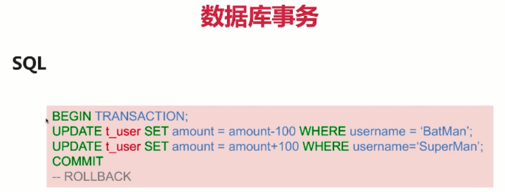
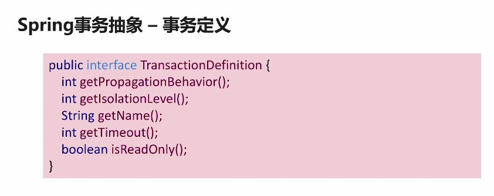
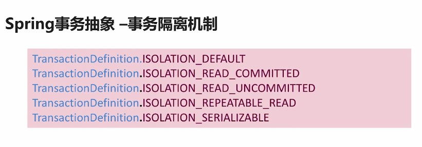
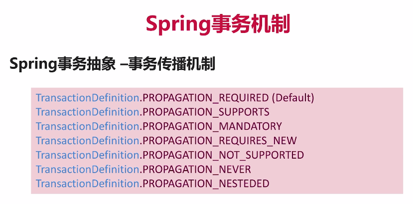
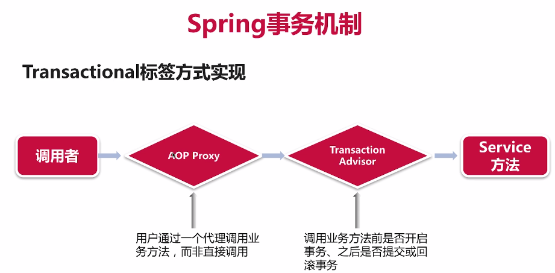
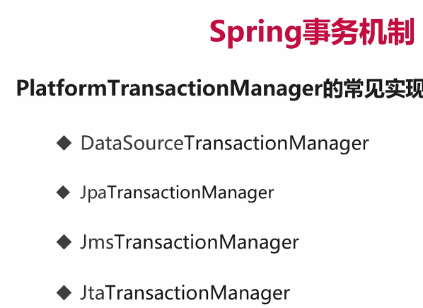
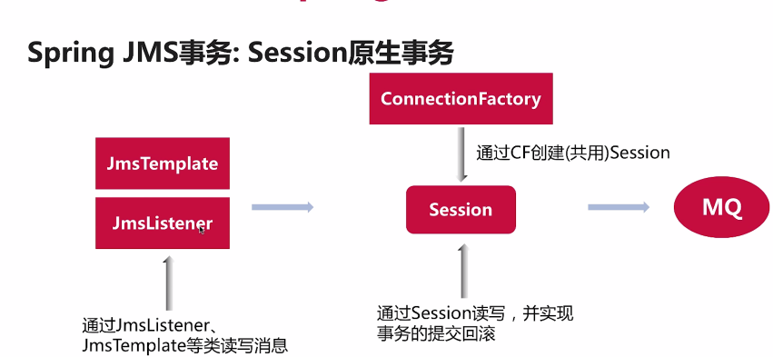

分布式事务实践
1、事务原则与实现
1.1、事务
 1.1.1、事务是什么？
   事务是以一种可靠、一致的方式，访问和操作数据库中数据的程序单元。
 1.1.2、事务四大特性——ACID
   a、原子性(A)：这一个事务当中的多个操作，要么都完成，要么都不完成；它不会出现只完成其中一部分这样的情况。
   b、一致性(C)：指的是我这个事务完成了以后它状态的改变是一致的，它的结果是完整的。
   c、隔离性(I)：在不同的事务，它们试图操作同样的数据的时候，它们之间的隔离性是什么样的。
   比如说一个事务中对数据的修改没有提交的情况下，我在另一个事务是否能看到这个未提交的数据。
   d、持久性(D)：当事务提交以后，数据操作的结果会进入数据库进行永久保存。
   
   
   
   
 1.1.3、事务原则与实现：SQL事务
 START TRANSACTION; #开启事务
 UPDATE t_user SET amount = amount + 100 WHERE username = 'SuperMan';
 UPDATE t_user SET amount = amount - 100 WHERE username = 'BatMan ';
 COMMIT;
 
 MySQL默认隔离级别： SELECT @@GLOBAL.tx_isolation, @@tx_isolation;——REPEATABLE-READ 可重复读
 
 四种隔离级别：
  a、脏读——READ UNCOMMITTED：读取到脏数据，即使是没有commit的数据我也能够读取到
  b、READ COMMITTED：只要别人提交了，就可以读取；第一次读和第二次读可能是不一样的；
  c、可重复读——REPEATABLE-READ：在一个事务内，重复读多次一条数据，读到的结果应该是一样的；第一次读和第二次读肯定是一样的；
  d、SERIALIZABLE——线性读：所有的事务操作必须是线性执行，想当于排队执行，隔离级别最高。
 
 设置脏读：SET SESSION TRANSACTION ISOLATION LEVEL READ UNCOMMITTED;
[Spring 事务机制详解](https://juejin.im/post/5a3b1dc4f265da43333e9049)
[Java中的事务——JDBC事务和JTA事务](http://www.hollischuang.com/archives/1658)
[MySQL 笔记 - 事务&锁](https://juejin.im/post/5b76938de51d45664715fba8)

2、Docker
2.1、Docker介绍
  Docker是一种轻量级的容器。它是使用操作系统级别的虚拟化技术对进程、软件系统和网络之类的资源，进行封装和隔离。
  看起来就好像一个独立的系统，所以它也叫做容器。
2.2、与传统的虚拟机异同
  比如VM，它其实是在宿主机器上，去虚拟出一套硬件。然后在这套硬件上面去安装一套操作系统。在这套操作系统上再去安装我们要使用的软件。
  而Docker是直接在操作系统上面把一部分的进程、软件系统、网络等隔离出来。让你觉得好像它是一个独立的操作系统。
  但是实际上它只是隔离了一个容器而已。它是运行在docker的引擎上面的，它不需要虚拟硬件，也不需要安装额外的操作系统。
  所以它非常的轻量，然后使用起来非常方便。
2.3、几个概念
 1)、Docker镜像-docker资源库
   它是保存在docker资源库里面的
 2)、Docker容器——Dockerfile
   定义使用的镜像，设置环境变量等
 3)、Docker服务——docker-compose
   把多个docker容器定义在一个文件
 4)、Docker集群-swam、Kubernetes
 
a、假设我需要部署一个Java应用，首先我需要一个Java的运行环境，所以说我在docker资源库里面找一个jdk的运行环境；
b、然后我想自动去设置java的编译、运行等等。那我就写一个Dockerfile文件，然后用Dockerfile文件定义出一个容器来，
在这个容器里面去运行java应用；
在Dockerfile文件里面需要指定要用的jdk镜像、设置源文件在本地的地址和需要映射到容器的地址、在镜像中安装Maven、映射网络端口，访问服务。
c、假设我的java应用要使用mysql或者其他的数据库，我现在在本地想把这些都设置到同一个docker服务的docker-compose里面，
那我就可以在docker-compose里面定义两个服务，其中一个是mysql，我可以设置mysql的镜像，另一个是java应用的docker，
两个docker容器就可以共享一个网络，相互之间有一个统一的关系等等，可以统一管理；
d、集群：假设我这个java应用可以进行分布式部署，可以部署在多台机器上就可以配置一个集群。

3、Spring事务机制
3.1、Spring事务机制：事务抽象、事务传播、事务隔离
3.1.1、Spring事务管理
a、提供统一的API接口支持不同的资源
b、提供声明式事务管理
c、方便的与Spring框架集成
d、多个资源的事务管理、同步

3.1.2、Spring事务抽象
a、 ：
提供事务管理器的接口，不管使用的是什么样的事务管理器的实现，但是我们都可以用这个接口来进行事务的管理。
包括：事务的开启、提交、回滚等操作。

b、TransactionDefinition
事务的定义。我们可以创建一个TransactionDefinition，然后给它设置一些事务的属性，
包括：传播属性、隔离属性等等。在通过这个定义创建一个具体的实例。

c、TransactionStatus
事务的运行状态，或者是运行的有状态的事务。

3.2、代码方式与标签方式的事务实现

CustomerServiceTxInAnnotation.java

CustomerServiceTxInCode.java

3.3、JPA、JMS事务实例
3.3.1、Spring事务实例
c3-1-spring-trans-jpa
1)、代码方式、标签方式实现事务
2)、JPA事务管理
3)、使用H2数据库(支持事务)

3.3.2、Spring JMS事务实例
3.3.2.1、Spring JMS Session
1)、通过Session进行事务管理
是Spring来访问MQ服务器的时候，用的session的对象。数据库读、写、提交、失误都是通过Session来进行操作的。
所以说JMS内部是支持事务的，有一个session级别的事务管理。每次读消息的时候，读完消息，它都会有所谓的一个提交，
确保这个消息已经读完。如果失败了，它会重新触发读。
2)、Session是thread-bound
由于Session可能是共用的，在应用里面它不会每次都重新建一个session或者说重新建一个连接。
每次在我新接收请求的时候，对于一个新的线程，它可能会共用以前的session或者说新建一个session来用。
每一个session在每一个线程里面它会有自己的一个事务，这个事务的生命周期就是session在thread里面的生命周期。
也就是说当我在我的应用里面读一个消息，然后处理，处理完往另外一个队列里面写消息的时候，
这个线程的操作就是 先读；然后处理；然后在写消息。这个session在这个过程中使用的是同一个session。
在进行事务管理的时候，读和写两个操作是在一个事务当中。只有所有这些操作都完成没有错误的情况下，然后它最后才会做一个commit操作，
把这个最后提交上去。
3)、事务上下文：在一个线程中的一个Session

3.3.2.2、Spring JMS事务类型
1)、Session管理的事务——原生事务

 
2)、Jms-session实例——c3-2-spring-trans-jms
对于session管理的jms事务而言，它的事务是作用在线程内 的生命周期上的。
对于listener触发的方法，listener用session去读了消息以后，触发了handle方法。
在handle里面触发了convertAndSend()。直到方法结束后这个listener才会去调用session的commit()去提交session管理的事务。
但是此时因为有一个异常，所以做了回滚操作。
   
如果直接调用handle方法的话，不通过listener，这个session事务的生命周期就只在convertAndSend()方法内部起作用，而不是整个handle方法起作用
所以就直接提交上去没有回滚。

3.3.2.3、外部管理的事务：JmsTransactionManager、JTA

1)、Spring Boot中使用JMS
2)、Spring Boot ActiveMQ Starter
3)、内置的可运行的ActiveMQ服务器
4)、实现读写ActiveMQ的事务