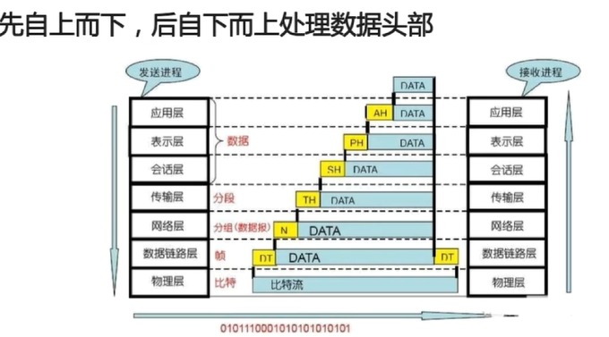
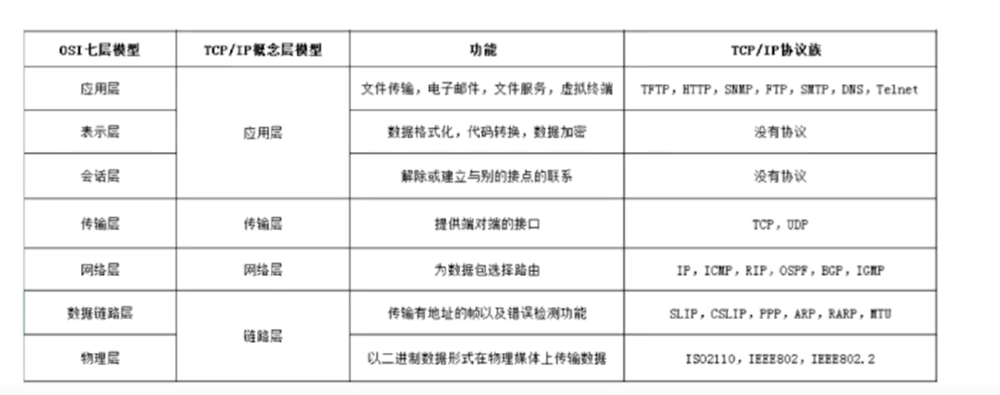

<<剑指Java面试-Offer直通车>>

## 一.计算机网络面试核心
### 1.网络基础知识讲解
#### 1.1 OSI开放式互联参考模型
第一层 物理层：机械、电子、定时接口通信信道上的比特流传输。
解决两台物理机之间的通讯需求：机器A往机器B发送比特流，机器B收到这些比特流，这便是物理层要做的事;
物理层主要定义了物理设备的标准。如：网线的类型、光纤的接口类型、各种传输介质的传输速率等。
它的主要作用是传输比特流(比特流：0101-二进制数据),将它们转化为电流强弱来进行传输,
到达目的后在转化为0101的机器码——也就是我们常说的数模转换与模数转换。
这层的数据叫做比特,网卡就是工作在这层里面的。

第二层 数据链路层：物理寻址,同时将原始比特流转变为逻辑传输线路。
在传输比特流的过程中会产生错传、数据传输不完整的可能，因此数据链路层应运而生。

数据链路层定义了如何格式化数据以进行传输,以及如何让控制对物理介质的访问。
这层通常还提供错误检测和纠正以确保数据传输的可靠性。
本层将比特数据组成了帧。交换机工作在这层里面,对帧解码,并根据帧中包含的信息把数据发送到正确的接受收方。

随着网络节点的不断增加，点对点通讯的时候是需要经过多个节点的。那么如何找到目标节点，如何选择最佳路径便成了首要需求。
此时便有了网络层。

第三层 网络层：控制子网的运行，如逻辑编址、分组传输、路由选择。
主要功能是将网络地址翻译成对应的物理地址,并决定如何从发送方路由到接受方。
网络层通过综合考虑：发送优先权、网络拥塞程度、服务质量以及可选路由的花费来决定，
从一个网络中节点A到另一个网络中节点B的最佳路径。
由于网络层处理并智能指导数据传送路由器连接网络各段，所以路由器属于网络层。
此层的数据我们称之为数据包，本层我们需要关注的协议主要是TCP/IP协议里面的IP协议。
随着网络通信需求的进一步扩大，通信过程中需要发送大量的数据。
如海量文件传输的，可能需要很长时间，而网络在通信的过程中会中断好多次，
此时为了保证传输大量文件时的准确性，需要对发出的数据进行切分，切割为一个一个的段落(segment)进行发送。
那么其中一个段落丢失了怎么办，要不要重传？每个段落要按照顺序到达吗？这个便是传输层要考虑的问题了。

第四层 传输层：接受上一层的数据，在必要额度时候把数据进行分割，并将这些数据交给网络层，且保证这些数据段有效到达对端。
传输层解决了主机间的数据传输，数据域间的传输可以是不同网络的，并且传输层解决了传输质量的问题，该层称之为OSI模型中最重要的一层了。
传输协议同时进行流量控制或是基于接收方可接受数据的快慢程度规定适当的发送速率。
除此之外传输层按照网络能处理的最大尺寸将较长的数据包进行强制分隔，
例如以太网无法接收大于1500字节的数据包，发送方节点的传输层将数据分割成较小的数据片，
同时对每一数据片安排一序列号以便数据到达接收方节点的传输层时，能以正确的顺序重组，
该过程成为排序。
传输层中需要关注的协议有TCP/IP协议中的TCP协议和UDP协议。
现在我们已经保证给正确的计算机发送正确的封装之后的信息了，但是用户级别的体验好不好，
难道我每次去调用TCP去打包，然后调用IP协议去找路由，自己去发？
当然不行，所以我们需要建一个自动收发包，自动寻址的功能，于是发明了会话层。

第五层 会话层：不同机器上的用户之间建立及管理会话
会话层的作用就是建立和管理应用程序之间的通信。
现在我能保证应用程序自动收发包和寻址了。但我要用Linux给Windows收发包，
两个系统语法不一致，就像安装包一样，exe是不能在Linux上运行的。
于是就有了表示层。

第六层 表示层：信息的语法语义以及它们的关联，如加密解密、转换翻译、压缩解压缩
表示层帮我们解决不同系统之间的通信语法的问题。在表示层数据将按照网络能理解的方案进行格式化。
这种格式化也因所使用网络的不同而不同，此时虽然发送方知道自己发送的是什么东西，
转换成字节数组之后有多长，但接收方肯定不知道。

第七层 应用层
所以应用层的网络协议诞生了，它规定发送方和接收方必须使用一个固定长度的消息头，
消息头必须使用某种固定的组成。而且消息头里必须记录消息体的长度等一系列信息。
以方便接收方能够正确的解析发送方发送的数据。应用层旨在让你更方便的应用从网络中接收到的数据。
至于数据的传递没有该层你也可以直接在两台电脑间开杠，只不过传来传去就是一个1和0组成的字节数组。
该层需要重点关注的是与之相对应的TCP/IP协议中的http协议。

OSI参考模型并不是一个标准，而是一个制定标准是所使用的概念型框架。
事实的标准是TCP/IP四层架构参考模型。

