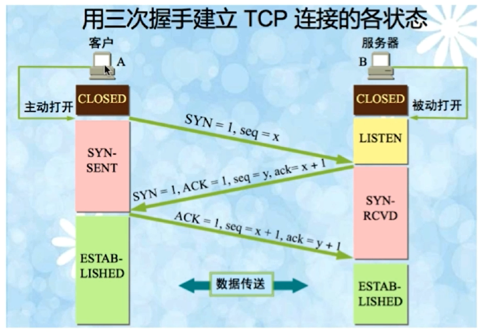
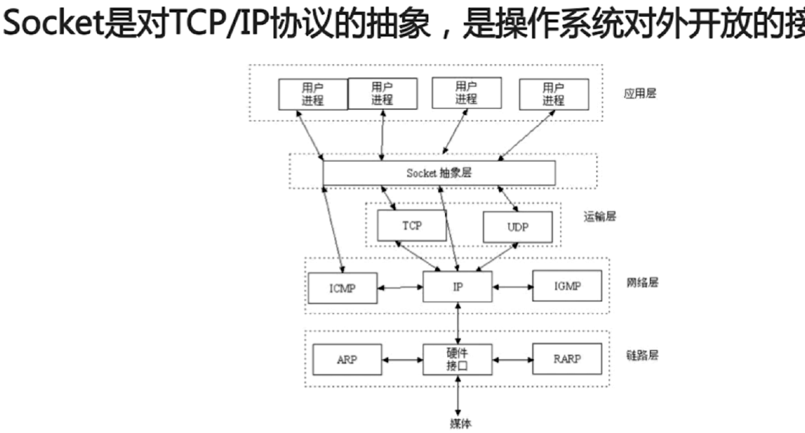
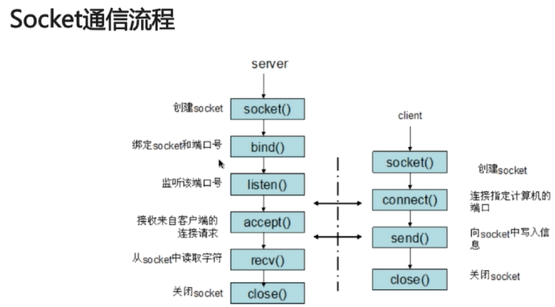
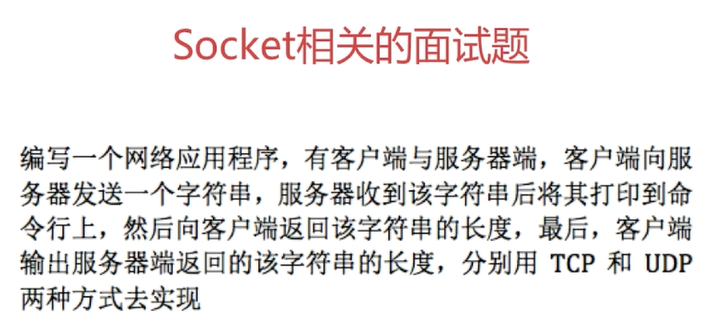
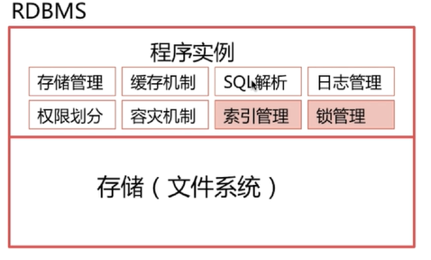

<<剑指Java面试-Offer直通车>>

## 一.计算机网络面试核心
### 1.网络基础知识讲解
#### 1.1 OSI开放式互联参考模型
第一层 物理层：机械、电子、定时接口通信信道上的比特流传输。
解决两台物理机之间的通讯需求：机器A往机器B发送比特流，机器B收到这些比特流，这便是物理层要做的事;
物理层主要定义了物理设备的标准。如：网线的类型、光纤的接口类型、各种传输介质的传输速率等。
它的主要作用是传输比特流(比特流：0101-二进制数据),将它们转化为电流强弱来进行传输,
到达目的后在转化为0101的机器码——也就是我们常说的数模转换与模数转换。
这层的数据叫做比特,网卡就是工作在这层里面的。

第二层 数据链路层：物理寻址,同时将原始比特流转变为逻辑传输线路。
在传输比特流的过程中会产生错传、数据传输不完整的可能，因此数据链路层应运而生。

数据链路层定义了如何格式化数据以进行传输,以及如何让控制对物理介质的访问。
这层通常还提供错误检测和纠正以确保数据传输的可靠性。
本层将比特数据组成了帧。交换机工作在这层里面,对帧解码,并根据帧中包含的信息把数据发送到正确的接受收方。

随着网络节点的不断增加，点对点通讯的时候是需要经过多个节点的。那么如何找到目标节点，如何选择最佳路径便成了首要需求。
此时便有了网络层。

第三层 网络层：控制子网的运行，如逻辑编址、分组传输、路由选择。
主要功能是将网络地址翻译成对应的物理地址,并决定如何从发送方路由到接受方。
网络层通过综合考虑：发送优先权、网络拥塞程度、服务质量以及可选路由的花费来决定，
从一个网络中节点A到另一个网络中节点B的最佳路径。
由于网络层处理并智能指导数据传送路由器连接网络各段，所以路由器属于网络层。
此层的数据我们称之为数据包，本层我们需要关注的协议主要是TCP/IP协议里面的IP协议。
随着网络通信需求的进一步扩大，通信过程中需要发送大量的数据。
如海量文件传输的，可能需要很长时间，而网络在通信的过程中会中断好多次，
此时为了保证传输大量文件时的准确性，需要对发出的数据进行切分，切割为一个一个的段落(segment)进行发送。
那么其中一个段落丢失了怎么办，要不要重传？每个段落要按照顺序到达吗？这个便是传输层要考虑的问题了。

第四层 传输层：接受上一层的数据，在必要的时候把数据进行分割，并将这些数据交给网络层，且保证这些数据段有效到达对端。
传输层解决了主机间的数据传输，数据域间的传输可以是不同网络的，并且传输层解决了传输质量的问题，该层称之为OSI模型中最重要的一层了。
传输协议同时进行流量控制或是基于接收方可接受数据的快慢程度规定适当的发送速率。
除此之外传输层按照网络能处理的最大尺寸将较长的数据包进行强制分隔，
例如以太网无法接收大于1500字节的数据包，发送方节点的传输层将数据分割成较小的数据片，
同时对每一数据片安排一序列号以便数据到达接收方节点的传输层时，能以正确的顺序重组，
该过程成为排序。
传输层中需要关注的协议有TCP/IP协议中的TCP协议和UDP协议。
现在我们已经保证给正确的计算机发送正确的封装之后的信息了，但是用户级别的体验好不好，
难道我每次去调用TCP去打包，然后调用IP协议去找路由，自己去发？
当然不行，所以我们需要建一个自动收发包，自动寻址的功能，于是发明了会话层。

第五层 会话层：不同机器上的用户之间建立及管理会话
会话层的作用就是建立和管理应用程序之间的通信。
现在我能保证应用程序自动收发包和寻址了。但我要用Linux给Windows收发包，
两个系统语法不一致，就像安装包一样，exe是不能在Linux上运行的。
于是就有了表示层。

第六层 表示层：信息的语法语义以及它们的关联，如加密解密、转换翻译、压缩解压缩
表示层帮我们解决不同系统之间的通信语法的问题。在表示层数据将按照网络能理解的方案进行格式化。
这种格式化也因所使用网络的不同而不同，此时虽然发送方知道自己发送的是什么东西，
转换成字节数组之后有多长，但接收方肯定不知道。

第七层 应用层
所以应用层的网络协议诞生了，它规定发送方和接收方必须使用一个固定长度的消息头，
消息头必须使用某种固定的组成。而且消息头里必须记录消息体的长度等一系列信息。
以方便接收方能够正确的解析发送方发送的数据。应用层旨在让你更方便的应用从网络中接收到的数据。
至于数据的传递没有该层你也可以直接在两台电脑间开杠，只不过传来传去就是一个1和0组成的字节数组。
该层需要重点关注的是与之相对应的TCP/IP协议中的http协议。

OSI参考模型并不是一个标准，而是一个制定标准是所使用的概念型框架。
事实的标准是TCP/IP四层架构参考模型。

### 2.TCP的三次握手
1.IP协议：IP协议是无连接的通信协议，它不会占用两个正在通信的计算机的通信线路，这样IP
就降低了对网络线路的需求。每条线可以同时满足许多不同计算机之间的通信需要，
通过IP，消息或者其他数据会被分割为较小的独立的包，并通过因特网在计算机之间传送，
IP负责将每个包路由至它的目的地，但IP协议没有做任何事情来确认数据包是否按顺序发送，
或者包是否被破坏，所以IP数据包是不可靠的，需要由它的上层协议来做控制。

2.传输控制协议TCP属于传输层的协议
TCP(Transmission Control Protocol)简介：
1).面向连接的、可靠的、基于字节流的传输层通信协议；
2).数据传输时，应用层向TCP发送数据流，然后TCP把数据流分隔成适当长度的报文段，
此后TCP把结果包传给IP层，由它通过网络将包传送给目标节点的TCP层；
3).TCP为了保证不丢失包就给每个包一个序号(Sequence Number)，同时序号也保证了传送到目标节点的
包的按序处理，然后接收端实体对已成功收到的包发送ACK-已成功确认，如果发送端实体在合理的往返时延未收到确认，
那么对应的数据包就被假设为已丢失并且将会对其进行重传；
4).TCP用一个校验和函数来检验数据在传输过程中是否有误，在发送和接收时都要计算校验和。

### 3.TCP三次握手
3.1 TCP报文头

1)、Source Port: 源端口，占2个字节
2)、Destination Port: 目的端口 占2个字节
TCP不包含IP地址信息，TCP和UDP均会有源端口和目的端口。端口是属于传输层知识范畴的。
两个进程在计算机内部进行通信，可以由管道、内存共享、信号量、消息队列等方法进行通信。
而两个进程如果需要进行通信最基本的前提是唯一能够标识一个进程，通过这个标识找到对应进程。
在本地进程通信中，我们可以使用pid(进程标识符)来唯一标识一个进程，但pid只在本地唯一，
如果把两个进程放在不同的两台计算机，它们要进行通信的话pid就不够用了。
这样就需要另外一个手段——在传输层中使用协议端口号(protocal port number)，
IP层的ip地址可以唯一标识一个主机，而TCP协议和端口号可以唯一标识主机中的一个进程，
这样我们可以利用IP地址+协议+端口号去标识网络中的一个进程。
在一些场合把这个唯一标识的模式称为套接字(Socket)。虽然通讯的重点是应用进程，
但我们只要把要传送的报文加上目的主机的某一个合适的端口，剩下的工作就由TCP来完成。
3)、Sequence Number(序号)：4个字节，TCP连接中，传送的字节流中的每个字节都按顺序去编号，
例如一段报文的序号字段值就是107，而携带的数据共有100个字段，那么如果有下一个报文段的话，
其序号就应该是从207(107+100)开始。
4)、ACK确认号：4个字节 期望收到对方下一个报文的第一个数据字节的序号。
例如B收到了A发送过来的报文，其序列号字段是301，而数据长度是200字节，
这表明了B正确的收到了A发送的到序号500(301+200-1)为止的数据，因此B期望收到A的下一个数据序号是501，
于是B在发送给A的确认号段中会把ACK确认号置为501。
5)、Offset(数据偏移)：由于头部有可选字段，长度不固定，因此它指出TCP报文的数据距离TCP起始处有多远，
6)、Preserved：保留域
7)、TCP Flags：控制位，主要由8个标志位组成，每个标志位表示一个控制功能。
 a、URG：紧急指针标志，当它为1时，表示紧急指针有效；为0则忽略紧急指针
 b、ACK(*)：确认序号标志，为1时表示确认号有效，为0表示报文中不含确认信息忽略确认号字段；
 c、PSH：push标志，为1时表示是带有push标志的数据，指示接收方在接收该报文段以后应尽快
  将这个报文段交个应用程序而不是在缓冲区排队；
 d、RST：重置连接标志，用于重置由于主机崩溃，或其他原因而出现错误的连接，
  或者用于拒绝非法的报文段，和拒绝连接请求；
 e、SYN(*)：同步序号，用于建立连接过程，在连接请求中SYN=1和ACK=0表示该数据段没使用捎带的确认域，
  而连接应答捎带的确认即SYN=1和ACK=1;
 f、FIN(*)：finish标志，用于释放连接，为1时表示发送方已经没有数据发送了，即关闭本方数据流。

8)、window窗口：表示滑动窗口的大小，用来告知发送端接收端的缓冲大小，以此控制发送端发送数据的速率，
 从而达到流量控制
9)、Checksum检验和：既有校验，此校验和是对整个的TCP报文段，包括TCP头部和TCP数据以16为进行计算所得，
 由发送端计算和存储，并有接收端进行验证
10)、Urgent Pointer(紧急指针)：只有当TCP中的URG为1的时候才有效
11)、TCP Options：可选项，定义一些其他的可选参数

当应用程序希望通过TCP与另一个应用程序通信时，它会发送一个通信请求，这个请求必须被送到一个确切的地址，
在双方握手之后TCP将在两个应用之间建立全双通的通信，这个全双通的通信将占用两个计算机的通信线路，
直到它被对方或双方关闭为止。

3.2 TCP三次握手流程图

"握手"是为了建立连接，TCP三次握手的流程如下：
在 TCP/IP 协议中，TCP协议提供可靠的连接服务，采用三次握手建立一个连接。
1)、第一次握手：建立连接时，客户端发送SYN包[syn=j]到服务器，并进入SYN_SEND状态，等待服务器确认；
2)、第二次握手：服务器收到SYN包，必须确认客户的SYN(ack=j+1)，同时自己也发送一个SYN包(syn=k)，即SYN+ACK包，
 此时服务器进入SYN_RECV状态；
3)、第三次握手：客户端收到服务器的SYN+ACK包，向服务器发送确认包ACK(ack=k+1)，此包发送完毕，客户端和服务器进入ESTABLISHED状态，
 完成三次握手。

3.3 为什么需要三次握手才能建立起连接
 为了初始化Sequence Number的初始值。
 通信的双方要互相通知对方自己的初始化的Sequence Number(seq)，这个号要作为以后的数据通信的序号，
 以保证应用层接收到的数据，不会英文网络上的传输问题而乱序，即TCP会用这个序号来拼接数据。因此，
 在服务器回发它的seq(即第二次握手之后)，还需要发送确认报文给服务器，告诉服务器说，客户端已经收到你的初始化的seq了。
3.4 首次握手的隐患——SYN超时
问题起因分析：
 1)、Server端收到Client的SYN，回复SYN-ACK的时候未收到ACK确认，此时的连接处于一个中间状态——未成功 也没有失败
 2)、Server不断重试直至超时，Linux默认等待63s才断开连接
针对SYN Flood的防护措施
 1)、SYN队列满后，通过tcp_syncookies参数回发SYN Cookie
 2)、若为正常连接则Client会回发SYN Cookie，直接建立连接
建立连接后，Client出现故障怎么办？
 保活机制
 1)、向对方发送保活探测报文，如果未收到响应则继续发送
 2)、直到尝试次数达到保活探测数仍未收到响应则中断连接

### 4.TCP四次挥手
"挥手"是为了终止TCP连接，TCP四次挥手的流程图如下：

1)、第一次挥手：Client发送一个FIN，用来关闭Client到Server的数据传送，Client进入FIN_WAIT_1状态；
2)、第二次挥手：Server收到FIN包之后，会发送一个ACK给Client，确认序号为收到序号+1(与SYN相同，一个FIN占用一个序号)，Server进入CLOSE_WAIT状态；
3)、第三次挥手：Server发送一个FIN，用来关闭Server到Client的数据传送，Server进入LAST_ACK状态；
4)、第四次挥手：Client收到FIN后，Client进入TIME_WAIT状态，接着发送一个ACK给Server，确认序号为收到序号+1，Server进入CLOSED状态，完成四次挥手。

4.1、为什么会有TIME_WAIT状态？
原因：
1)、TIME_WAIT状态是为了确保有足够的时间让对方收到ACK，如果被动关闭的一方没有收到ACK就会触发被动端重发FIN包，
一来一去正好是2个MSL；
2)、有足够的时间让这个连接，不会跟后面的连接混合在一起，因为有些路由器会缓存IP数据包，如果连接被__，那么这些延迟被收到的包就有可能会跟新链接混在一起。

4.2、为什么需要四次握手才能断开连接？
因为TCP是全双工的，发送方和接收方都需要FIN报文和ACK报文，也就是说发送方和接收方各只需两次挥手即可，
只不过有一方是被动的，所以看上去就成了所谓的四次挥手。

4.3、服务器出现大量CLOSE_WAIT状态的原因
客户端一直在请求，但是返回给客户端的信息是异常的，服务端压根就没有收到请求。
在对方关闭socket连接，我方忙于读或写，没有及时关闭连接。
解决：
1)、检查代码，特别是释放资源的代码;
2)、检查配置，特别是处理请求的现成配置。

### 5.TCP和UDP的区别
5.1、UDP简介：用户数据报协议(User Datagram Protocol)

源端口
目标端口
数据包长度
既有校验值
用户数据

5.2、UDP特点
1)、面向非连接，传输数据之前源端和终断不建立连接，当它想传送时就简单抓取来自应用程序的数据，
并尽可能快的把它扔到网络上，在发送端UDP传送数据的速度仅仅是受应用程序生成数据的速度、计算机的能力、和传输带宽的限制，
在接收端UDP把每个消息段放到队列中，应用程序每次从队列中读取一个消息段；
2)、由于传输数据不建立连接，因此也就不需要维护连接状态，因此一台服务器可同时向多个客户端传输相同的消息；
3)、UDP数据包报头只有8个字节，相对于TCP额外开销较小；
4)、吞吐量只受应用软件生成数据的速率、传输带宽、源端和终端主机性能的限制；
5)、UDP尽最大努力交付，不保证可靠交付，不需要维持负载的链接状态表；
6)、UDP是面向报文的，发送方的UDP对应用程序交互下来的报文再添加守护后，向下交互给IP层，既不拆分也不合并而是保留这些报文的边界，
因此应用程序需要选择合适的报文大小；

5.3、TCP和UDP的区别
TCP和UDP是OSI模型中的运输层中的协议。TCP提供可靠的通信传输，而UDP则常被用于让广播和细节控制交给应用的通信传输。
二者区别如下：
1)、TCP面向连接，UDP面向无连接。TCP有三次握手的连接过程，UDP适合消息的多拨发布，
从单个点向多个点传输信息；
2)、可靠性：TCP是比较可靠的，是利用握手、确认和重传机制提供了可靠性保证，而UDP则可能会丢失，
没有不知道到底有没有被接收；
3)、有序性：TCP利用序列号保证了消息包的顺序交互，到达可能无序，但TCP最终会排序，
而UDP是不具备有序性的；
4)、速度：TCP速度较慢吗，因为要创建连接保证消息的可靠性和有序性需要做额外的很多事情，UDP则更适合对速度比较敏感的应用，
比如：在线视频媒体、电视广播、多元在线游戏等；
5)、量级：TCP属于重量级的，UDP属于轻量级的体现在源数据的头大小

### 6.TCP的滑窗
6.1、RTT和RTO
RTT(Round Trip Time)：发送一个数据包到收到对应的ACK，所花费的时间
RTO(Retransmission TimeOut)：重传时间间隔

6.2、TCP的滑动窗口
TCP会将数据拆分成段进行发送，出于效率和传输速度的考虑，我们不可能等一段一段数据去发送，等到上一段数据被确认后在发送下一段数据，
这个效率是非常低的，我们是要实现对数据的批量发送，TCP必须要解决可靠传输以及包乱序的问题。
所以TCP就要知道网络实际的数据处理带宽，或是数据处理的速度，这样才不会引起数据拥塞导致丢包。

TCP使用滑动窗口做流量控制与乱序重排，TCP的滑动窗口主要有两个作用：
 1)、保证TCP的可靠性
 2)、保证TCP的流控特性
 
6.3、滑动窗口的基本原理
对于TCP会话的发送方，任何时候在其发送缓存内的数据都可以分为四类：
 a、已经发送并且得到端的回应
 b、已经发送但还没有得到端的回应
 c、未发送但对端允许发送的
 d、未发送且由于达到window的大小对端不允许发送的数据
其中，b、c组成的连续空间就称为滑动窗口。
当收到接收方新的ACK对于发送窗口中后续字节的确认时，窗口就会进行滑动。

总结：
TCP最基本的可靠性来源于确认重传机制，TCP的滑动窗口的可靠性也是建立在重传基础上的，发送窗口只有收到接收端对于本段发送窗口内字节的ACK确认，
才会移动发送窗口的左边界，接收窗口只有在前面所有的段都确认的情况下才会移动左边界，当在前面还有字节未接收但收到后面字节的情况下，窗口是不会移动的，
并不对后续字节确认，一次确保对端会对这些数据重传。

### 7.HTTP相关
7.1、HTTP简介
HTTP(HyperText Transfer Protocol,超文本传输协议)：属于应用层协议，它是基于请求与响应模式的无状态的应用层协议，
常基于TCP的连接方式。http1.1版本中，给出一种持续连接的机制(KeepAlive)，绝大多数web开发都是构建在http协议之上的web应用。

主要特点：
1)、支持客户/服务器模式
2)、简单快速，客户端向服务器请求服务的时候，只需传送请求方法和路径；
请求方法常用的有：GET、HEAD、PUT；每种方法规定了客户端与服务器联系的类型不同；
由于http协议简单，使得http服务器的程序规模小，因而通讯速度很快；
3)、灵活，http允许传输任意类型的数据对象，正在传输的类型由Content Type加以标记；
4)、无连接，无连接的含义是限制每次连接只处理一个请求；服务器处理完客户的请求，并收到客户的应答后，即断开连接，采用这种方式可以节省传输时间，
从HTTP 1.1起，默认使用长连接，即服务器需要等待一段时间后，才断开连接，以保证连接特性；
5)、无状态，HTTP协议是无状态协议。无状态是指协议对于事务处理没有记忆能力。缺少状态意味着如果后续处理需要前面的信息，则必须重传，这样可能导致每次连接传送的数据量增大。
另一方面，在服务器不需要先前信息时它的应答就较快；

7.2、HTTP请求结构

主要由 请求行、请求头部、空行、请求正文四部分组成。
1)、请求行：包括 请求方法(GET、PUT)、URL、协议版本号(HTTP 1.0/HTTP 1.1)
2)、请求头：名字 + ： + 空格 + 值

7.3、HTTP响应结构

状态行、响应头部、响应正文

HTTP协议采用了请求/响应模型，客户端向服务器发送一个请求报文，请求报文包含 请求方法、URL、协议版本、请求头部和请求数据，
服务器以一个状态行作为响应，响应的内容包括协议的版本、成功/错误代码、服务器信息、响应头部、响应数据。

7.4、请求/响应步骤
 1)、客户端连接到Web服务器，一个HTTP客户端通常是浏览器与Web服务器的http端口，默认端口号是80，建立一个TCP套接字连接；
 2)、发送HTTP请求，即通过TCP套接字客户端向Web服务器发送一个文本的请求报文；
 3)、服务器接受请求并返回HTTP响应，Web服务器解析该请求，定位请求资源，服务器将资源副本写到TCP套接字由客户端读取；
 4)、释放TCP连接，若我们的连接模式为CLOSE，则服务器主动关闭TCP连接；客户端被动关闭连接释放TCP连接；
 若我们的连接模式为KeepAlive，则该模式会保持一段时间，在该时间内可以继续接收请求；
 5)、客户端浏览器解析HTML内容

面试：
1、在浏览器地址栏键入URL，按下回车之后经历的流程
 1)、浏览器会依据URL逐层查询DNS服务器缓存，解析URL中的域名所对应的IP地址；
 DNS缓存从近到远依次是 浏览器缓存、系统缓存、路由器缓存、IPS服务器缓存、根域名服务器缓存以及域名服务器缓存；
 从哪个服务器找到对应的IP则直接返回不在查询后面的缓存；
 2)、找到IP地址后，会根据IP地址和对应端口(模认80端口)，和服务器建立TCP连接（三从握手）
 3)、浏览器发送HTTP请求，该请求将发送给服务器
 4)、服务器对浏览器请求作出响应，并把对应的带有HTML文本的HTTP响应报文发送给浏览器；
 5)、浏览器收到HTML并在显示窗口内渲染
 6)、浏览器释放连接（四次挥手），连接结束
 
2、HTTP状态码

3、GET请求和POST请求的区别。
从三个层面解答。
 1)、HTTP报文层面：
  GET将请求信息放在URL，请求信息和URL之间以问号隔开，请求信息的格式为键值对；
  POST将请求信息放在报文体中，想获得请求信息必须解析报文，因此安全性较GET安全一些；
  
  事实上，要获得报文中的请求信息也是很容易的，因此安全性上两者并没有太多区别，具体解决传输过程中的安全问题，还要靠HTTPS。

  由于GET中的请求信息设置在URL中，因此是有长度限制的，因为URL本身是没有长度限制的，但是浏览器会对URL作出长度限制；
 POST将请求信息放在报文体中因此对报文长度是没有限制的
 
 2)、数据库层面：GET符合幂等性和安全性，POST不符合
  幂等性：对数据库的一次操作和多次操作获得的结果是一致的
  安全性：对数据库的操作，没有改变数据库中的数据
  GET请求是做查询操作的，因此不会改变数据库中原有的数据，大致的可以认为是符合幂等性和安全性的；
  POST则都不符合，POST请求方式会往数据库中提交数据，因此会改变数据库中的数据，
 其次POST请求方式每次获得的结果都有可能不一样，因为POST请求时作用在上一级的URL上的，则每一份请求都会添加一份新资源；
  这也是POST和GET的最大区别；
  
  3)、其他层面：GET可以被缓存、被存储、而POST不行
  GET请求会保存到浏览器的浏览记录中，GET请求URL能保存为浏览器书签
  POST请求不具备上诉功能；
  缓存也是GET请求被广泛应用的根本。
 
4、Cookie和Session的区别
因为HTTP是无状态的，也就意味着我们每次访问某个有登录需求的页面的时候都要不厌其烦的输入账号密码。
现实生活中，并没有出现这样的情况，这是因为引入了某些机制让HTTP具备了状态。其中的两个便是Cookie和Session。

Cookie简介：Cookie技术是客户端的解决方案，Cookie是由服务器发送给客户端的特殊信息，以文本的形式存放在客户端。
客户端每次向服务器发送请求的时候都会带上这些特殊的信息。
当用户使用浏览器访问一个支持Cookie的网站的时候，用户会提供包括用户名在内的个人信息，并且提交至服务器；
紧接着服务器在向客户端回传相应的超文本的同时也会返回这些信息，当然这些信息并不是存放在HTTP响应体（response body）中的，
而是放在http响应头(response head)，当用户端浏览器接受到来自服务器的响应的时候，浏览器会将这些信息存放在一个统一的位置；
自此，客户端再向服务端发送请求的时候，会把响应的Cookie发送至相应的服务器中；
服务器接受到之后，回解析Cookie与客户端相对应的内容。

Session简介：Session机制是一种服务器端的机制，服务器使用了一种类似于散列表的结构来保存信息。
当程序需要为某个客户端的请求创建一个Session的时候，服务器首先检查这个客户端的请求里是否包含了一个session标识，
称为sessionId，如果已包含则说明以前已经为此客户端创建了Session，服务器就按照sessionId把这个Session检索出来使用。
如果检索不到就可能会新建一个，如果客户端请求不包含sessionId，则为此客户端创建一个Session，并且生成一个与此Session相关的sessionId。
sessionId的值是一个既不会重复又不容易被找到规律的字符串。sessionId会在本次响应中回发给客户端进行保存。

区别：
 1)、Cookie数据存放在客户的浏览器上，Session数据放在服务器上；
 2)、Session相对于Cookie更安全
 3)、Session会在一定时间内保存在服务器上当访问增多会比较占用服务器的性能，考虑到减轻服务器的使用开销应当使用Cookie。
 
5、HTTP和HTTPS的区别。
HTTP(HyperText Transfer Protocol,超文本传输协议)
HTTPS(Hyper Text Transfer Protocol Secure,超文本传输安全协议)

HTTPS是一种以计算机网络安全通信为目的的传输协议。在HTTP下面加入了SSL层，
从而具有了保护交换数据隐私以及完整性、提供对网站服务器身份验证的功能。简单来说，它就是安全版的HTTP。

SSL(Security Sockets Layer，安全套接层)：
 1)、为网络通信提供安全及数据完整性的一种安全协议
 2)、SSL位于TCP与各应用层之间是操作系统对外提供的API，SSL3.0后更名为TLS
 3)、SSL采用身份验证和数据加密保证网络通信的安全和数据的完整性

加密的方式：
 1)、对称加密：加密和解密都使用同一个密钥；
 2)、非对称加密：加密使用的密钥(公钥)和解密使用的密钥(私钥)是不相同的；
公钥和算法都是公开的，私钥是保密的，分对称加密性能较低但是安全性超强；由于其加密特性非对称加密算法能加密的长度也是有限的；
 3)、哈希算法：将任意长度的信息转换为固定长度的值，算法不可逆，常见的是MD5算法
 4)、数字签名：证明某个消息或者文件是某人发出/认同的
在实际的执行中，仅适用其中的某种方式并不能满足生产要求，要么非对称加密性能过低，要么对称密钥容易泄露。
因此HTTPS使用的是证书配合各种加密手段的方式。打出了一套相对安全的组合拳。

HTTPS数据传输流程：HTTPS在进行数据传输之前，会与网站服务器和Web浏览器进行一次握手，在握手时确认双方的加密密码信息；
具体过程如下：
 1)、Web浏览器将支持的加密算法信息发送给服务器；
 2)、服务器会选择一套浏览器支持的加密算法，将验证身份信息以证书的形式回发浏览器；
 3)、当浏览器收到证书之后首先会验证证书合法性，并结合证书公钥加密信息发送给服务器；
 4)、当网站服务器接收到浏览器发送过来的数据后，会使用网站本身的私钥将信息解密确定密码，然后通过密码解密Web浏览器发送过来的握手信息，
并验证哈希是否与Web浏览器一致，然后服务器会使用密码加密新的握手信息发送给浏览器
 5)、客户端浏览器解密，并计算经过哈希算法加密的握手消息，如果与服务器发送过来的Hash值一致，则此握手过程结束后服务器与浏览器会使用之前浏览器生成的随机密码和对称加密算法进行加密，
然后交换数据。

HTTP和HTTPS的区别：
 1)、HTTPS需要到CA申请证书(收费)，HTTP不需要；
 2)、HTTPS密文传输，HTTP明文传输；
 3)、连接方式不同，HTTPS默认使用443端口，HTTP使用80端口；
 4)、HTTPS=HTTP+加密+认证+完整性保护，较HTTP安全；

6、HTTPS真的很安全吗？
那倒未必。
 1)、浏览器默认填充http://，请求需要进行跳转，有被劫持的风险；
 2)、可以使用HSTS(HTTP Strict Transport Security)优化。

### 8.socket相关
两个进程如果需要通信最基本的一个前提是能够唯一的标识一个进程。在本地进程通信中我们可以使用PID来唯一标识一个进程，
但是PID只在本地唯一，网络中的两个进程PID冲突的几率还是有的，此时就需要另辟蹊径。

IP层的IP地址可以唯一标识一台主机，而TCP协议和端口号可以唯一标识主机的一个进程，这样我们可以利用IP+协议+端口号来唯一标识网络中的一个进程。
能够标识之后，它们就可以用socket进行通信了。

Socket相关的面试题：

### 2.数据库
关系型数据库考点：架构、索引(*)、锁(*)、语法、理论范式。
一个面试题引发的[血案]
(面试)如何设计一个关系型数据库？

首先数据库的最主要功能就是存储数据，因此它会有一个存储模块(文件系统)来负责存储数据；存储模块就类似OS文件系统，
将数据最终持久化存入磁盘中；可是光存储还是不行的，我们还需要组织，并且用到这些数据，因此我们还需要程序实例，
用逻辑结构来映射出物理结构，并且在程序中提供获取以及管理数据的方式还有必要的问题追踪机制。
接下来细分下程序的模块：
a、首先对数据的格式，以及文件的风格进行统一的管理，即把物理数据通过逻辑的形式给组织和表示出来，
 于是便涉及到了存储管理模块（注：为了执行效率，尽可能的减少IO）；
b、为了更快更好的优化程序，应该想到做项目的时候使用缓存机制；
c、提供给外界指令来操作数据库——可读的SQL语言，需要一个SQL解析模块，将SQL编译解析转换成机器可识别的指令；
 需要注意缓存不宜过大，算法中需要淘汰机制，淘汰一些不常用的数据；
d、此外做的SQL操作需要记录下，来方便我们做数据库的主从同步或者灾难恢复，因此需要日志管理去对操作记录做记录；
e、需要提供用户管理数据的私密空间——权限划分；
f、异常机制——容灾机制；
g、索引管理(*)
h、锁管理(*)

#### 2.1索引模块(*)
常见问题
 1、为什么要使用索引？
  我们先试试用最简单的方式实现查询——全表扫描，即将整张表的数据全部或者分批次加载到内存当中。我们知道存储的最小单位是块或者页，
  它们是由多行数据组成的，主动去轮询找到我们要的目标并返回，这种方式是很慢的，当只有很少的数据查询效率会高，
  但是在数据流很大的表里进行查询的时候该方法显然不适用了，因此很多情况下需要避免全表扫描的情况发生，所以数据库引入一种更高效的机制，
  这便是索引了，它的灵感来自于字典。
  
 2、什么样的信息能成为索引？
  主键、唯一键以及普通键等。
 3、索引的数据结构
  二叉查找树、平衡二叉树、红黑树、B-Tree、B+-Tree(mysql)、Hash结构
 4、密集索引和稀疏索引的区别

#### 2.1.1优化索引-二叉查找树(*)
二叉查找树是每个节点最多有两个子树的树结构，通常子树被称作左、右子树。
二叉查找树的重要性知识，对于树中的每一个节点X，它的左子树的任意节点的值均小于X，
同时，右子树的任意节点的值均大于X。
平衡二叉树：任意一个节点的左子树，它的高度不超过1。

二叉查找树的查找用的是二分查找，对半搜素，时间复杂度是O(logn)。
缺点：

#### 2.1.2优化索引-B-Tree(*)

B-Tree：平衡多路查找树，如果每个节点最多有M个孩子，那么这样的树就是M阶B树。
定义：
 1)、根节点至少包括两个孩子
 2)、树中每个节点最多包含有m孩子(m>=2)
 3)、除根节点和叶节点外，其他每个节点至少有ceil(m/2)个孩子，ceil——取上限。
 4)、所有叶子节点都位于同一层

#### 2.1.3优化索引-B+树(*)

B+树：是B树的变体，其定义基本与B树相同，除了：
 1)、非叶子节点的子树指针与关键字个数相同
 2)、非叶子节点的子树指针P[i],指向关键字值[K[i], K[i+1])的子树
 3)、非叶子节点仅用来索引，数据都保存在叶子节点中
 4)、所有叶子节点均有一个链指针指向下一个叶子节点

结论：B+数更适合用来做存储索引。
 1)、B+树的磁盘读写代价更低，B+树的内部结构并没有指向具体信息的指针，不存放数据只存放索引信息，
  因此其内部节点相比于B树更小，如果把所有同一内部节点的关键字存放在同一盘块中，
  这个盘块所能容纳关键字数量也就越多，一次性读入内存的关键字数量也越多，想对来说IO读写次数降低了；
 2)、B+树的查询效率更加稳定，由于内部节点并不是最终指向文件内容的节点，而只是叶子节点中关键字的索引，
  所以任何关键字的查找，必须走一条从根节点到叶子节点的路，所有关键字查询的长度相同，
  导致每一个数据的查询效率也几乎是相同的——O(logn);
 3)、B+树更有利于对数据库的扫描，B树在提高了磁盘的IO性的同时并没有解决元素遍历的效率低下的问题，
  而B+树只需要遍历叶子节点就可以解决对全部关键字的扫描，所以用于数据库中频繁使用的范围查询，
  这也是数据库选择B+树作为主流索引数据结构的原因。

#### 2.1.4优化索引-运用Hash以及BitMap(*)

缺点：
 1)、仅仅能满足"=","IN"，不能使用范围查询
 2)、无法被用来避免数据的排序操作
 3)、不能利用部分索引键查询
 4)、不能避免表扫描
 5)、遇到大量Hash值相等的情况后性能并不一定就会比B-Tree索引高
 
 BitMap索引是个神器——位图索引。