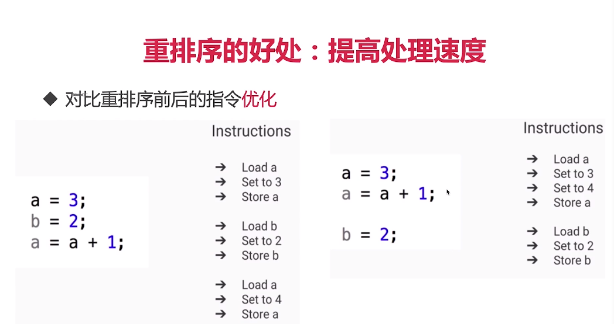
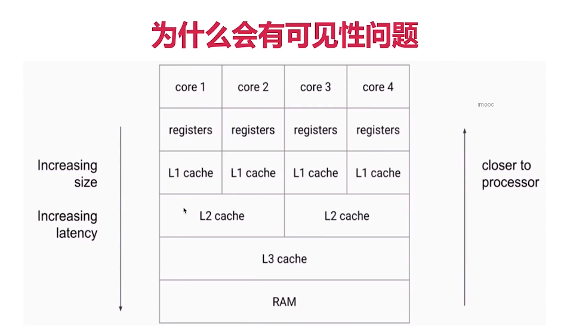
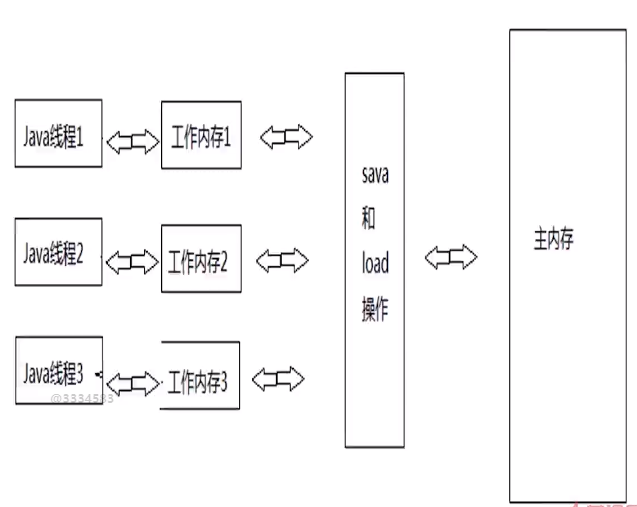

Java内存模型————底层原理

彩蛋：自顶向下的好处
什么是自顶向下？
先讲使用场景，再讲用法，最后讲原理。
先从现象出发，再看背后原因。

1、什么叫底层原理？
我们在Java代码中，使用的控制并发的手段例如synchronized关键字，最终也是要转化为CPU指令来生效的，
我们来回顾一下，从Java代码到最终执行的CPU指令的流程： 
1)、最开始，我们编写的Java代码，是*.java文件 
2)、在编译（javac命令）后，从刚才的*.java文件会变出一个新的Java字节码文件（*.class） 
3)、JVM会执行刚才生成的字节码文件（*.class），并把字节码文件转化为机器指令 
4)、机器指令可以直接在CPU上运行，也就是最终的程序执行 
而不同的JVM实现会带来不同的“翻译”，不同的CPU平台的机器指令又千差万别；
所以我们在java代码层写的各种Lock，其实最后依赖的是JVM的具体实现（不同版本会有不同实现）和CPU的指令，才能帮我们达到线程安全的效果。
由于最终效果依赖处理器，不同处理器结果不一样，这样无法保证并发安全，
所以需要一个标准，让多线程运行的结果可预期，这个标准就是JMM。

2、三兄弟：JVM内存结构 VS Java内存模型 VS Java对象模型
2.1 JVM内存结构：和Java虚拟机的运行时区域有关

2.1.1 堆(heap): 整个区域中最大的一块，所占用的内存也是最多的，并且在所有线程间共享；
主要保存一些通过 new或者其他指令所创建的一些实例对象，也包括数组，这些实例对象如果不再被引用就会被垃圾回收；
堆的优势在运行时动态分配。

2.1.2 虚拟机栈(VM stack):也叫Java栈，线程私有
这个栈中保存了一些基本的数据类型，以及对于对象的引用

2.1.3 方法区(method area):线程共享
存储已经加载的各个static 静态变量，或者是类信息以及常量信息，还包含了永久引用

2.1.4 本地方法栈：线程私有
保存和本地方法相关，主要是native方法

2.1.5 程序计数器：线程私有
所占区域最小，主要保存当前线程所执行到的字节码的行号数，也就是上下文切换是的数据， 
还包括下一条需要执行的指令、分支、循环等异常处理。

2.2 Java内存模型(*)：和Java并发编程有关

2.3 Java对象模型：和Java对象在虚拟机中的表现形式有关

1)、Java对象自身的存储模型
2)、JVM会给这个类创建一个instanceKlass，保存在方法区，用来在JVM层表示该Java类；
3)、当我们在Java代码中，使用new创建一个对象的时候，JVM会创建一个instanceOopDesc对象，这个对象中包含了对象头以及实例数据；

3、JMM是什么?
3.1 为什么需要JMM？——Java Memory Model
C语言不存在内存模型的概念，导致很多行为依赖于处理器本身的内存一致性模型，
不同的处理器结果不一样；无法保证并发安全；所以在这个情况下就需要一个标准，让多线程运行的结果可预期。

3.2 JMM是什么？
1)、JMM是一种规范，需要各个JVM的实现来遵守的，以便于开发者可以利用这些规范，更方便的开发多线程程序。
2)、JMM是工具类和关键字的原理：volatile、synchronized、Lock等的原理都是JMM

JMM性质：重排序、可见性、原子性

4、重排序(*)
4.1 重排序的代码案例、什么是重排序
4.4.1重排序分析：OutOfOrderExecution.java
这4行代码的执行顺序决定了最终x和y的结果，一共有3种情况：
1)、a=1; x=b(0); b=1;y=a(1); 最终结果是：x=0,y=1；
2)、b=1; y=a(0); a=1;x=b(1); 最终结果是：x=1,y=0；
3)、b=1; a=1; x=b(1);y=a(1); 最终结果是：x=1,y=1；

4)、运行结果：第9746次（0,0)，发生重排序了：执行顺序可能是：y=a; -> a=1; -> x=b; -> b=1;
原本线程顺序：线程1先给a赋值，再给x赋值；而线程2先给b赋值，再给y赋值；

4.4.2 什么是重排序？
在线程1内部的两行代码的实际执行顺序和代码在Java文件中的顺序不一致，代码指令并不是严格按照代码语句顺序执行的，它们的顺序被改变了，这就是重排序，这里被颠倒的是y=a和b=1这两行语句。

4.2 重排序的好处：提高处理速度

4.3 重排序的3种情况：编译器优化、CPU指令重拍、内存的"重排序"
1)、编译器优化：包括JVM，JIT编译器等
2)、CPU指令重拍：就算编译器不发生重拍，CPU也可能对指令进行重排
3)、内存的“重排序”：线程A的修改 线程B却看不到 引出可见性问题

4.4 重排序的3种情况分别是什么？ 
解答：  
1).编译器优化 编译器（包括JVM，JIT编译器等）出于优化的目的（例如当前有了数据a，那么如果把对a的操作放到一起效率会更高，避免了读取b后又返回来重新读取a的时间开销），
在编译的过程中会进行一定程度的重排，导致生成的机器指令和之前的字节码的顺序不一致。
 在刚才的例子中，编译器将y=a和b=1这两行语句换了顺序（也可能是线程2的两行换了顺序，同理），
 因为它们之间没有数据依赖关系，那就不难得到 x =0，y = 0 这种结果了。 
2).指令重排序 CPU 的优化行为，和编译器优化很类似，是通过乱序执行的技术，来提高执行效率。
 所以就算编译器不发生重排，CPU 也可能对指令进行重排，所以我们开发中，一定要考虑到重排序带来的后果。 
 
3).内存的“重排序” 内存系统内不存在重排序，但是内存会带来看上去和重排序一样的效果，所以这里的“重排序”打了双引号。
 由于内存有缓存的存在，在JMM里表现为主存和本地内存，由于主存和本地内存的不一致，会使得程序表现出乱序的行为。
 在刚才的例子中，假设没编译器重排和指令重排，但是如果发生了内存缓存不一致，也可能导致同样的情况：
 线程1 修改了 a 的值，但是修改后并没有写回主存，所以线程2是看不到刚才线程1对a的修改的，所以线程2看到a还是等于0。
 同理，线程2对b的赋值操作也可能由于没及时写回主存，导致线程1看不到刚才线程2的修改。

5、可见性(*)
可见性指的是确实有一个东西存在，但是其他的人看不到我，其他线程无法感知到我内容的变化。
5.1 演示什么是可见性问题
FieldVisibility.java
分析四种情况：
a=3,b=2
a=1,b=2
a=3,b=3

b= 3, a = 1(罕见)：发生可见性问题
b看到了真实的值是3，但是a还没完全同步过来，只能找原始的a也就是1
解决方法：volatile修饰变量————volatile 强制写入主存。

5.2 为什么会有可见性问题？

主存中的数据不是最新的，到时线程通信不一致。

由于CPU有多级缓存，导致读的数据可能会过期；
  (1) 高速缓存的容量比主内存小，但是速度仅次于寄存器，所以在CPU和主内存之间就多了Cache层
  (2) 线程间的对于共享变量的可见性不是直接由多核引起的，而是由多缓存引起的。
  (3) 如果所有的核心都只用一个缓存那么也就不存在内存可见性问题了
  (4) 每个核心都会将自己需要的数据读到独占缓存中，数据修改后也是写入到缓存中，然后等待刷入到主存中。所以会导致有些核心读取的值是一个过期的值。
  
5.3 JMM的抽象：主内存和本地内存
5.3.1 什么是主内存和本地内存？

(1) Java 作为高级语言，屏蔽了CPU多层缓存这些底层细节，用 JMM 定义了一套读写内存数据的规范，虽然我们不再需要关心一级缓存和二级缓存的问题，但是，JMM 抽象了主内存和本地内存的概念。 
(2) 这里说的本地内存并不是真的是一块给每个线程分配的内存，而是 JMM 的一个抽象，是对于寄存器、一级缓存、二级缓存等的抽象。

5.3.2 主内存和本地内存的关系
JMM有以下规定：
(1) 所有网点变量都存储在主内存中，同时每个线程也有自己独立的工作内存，工作内存中的变量内容是主内存中的拷贝；
(2) 线程不能直接读写主内存中的变量，而是只能操作自己工作内存中的变量，然后再同步到主内存中；
(3) 主内存是多个线程共享的，但是线程间不共享工作内存，如果线程间需要通信，必须借助主内存中转来完成；

总结：所有的共享变量存在于主内存中，每个线程有自己的本地内存，而且线程读写共享数据也是通过本地内存交换的，所以才导致了可见性问题。

5.4 Happens-Before原则
5.4.1 什么是Happens-Before？
FieldVisibility.java
(1) Happens-Before规则是用来解决可见性问题的：在时间上，动作A发生在动作B之前，B保证能看见A，这就是Happens-Before.
(2) 两个操作可以用happens-before来确定它们的执行顺序，如果一个操作happens-before于另一个操作，那么我们说第一个操作对于第二个操作是可见的。

5.4.2 Happens-Before规则有哪些？
(1) 单线程规则
(2) 锁操作(synchronized和Lock)（*）
(3) volatile变量（*）FieldVisibility.java
(4) 线程启动
(5) 线程join
(6) 传递性
(7) 中断
(8) 构造方法
(9) 工具类的Happens-Before原则
  a、线程安全稳定容器get一定能看到在此之前的put等存入动作
  b、CountDownLatch
  c、Semaphore
  d、Future
  e、线程池
  f、CyclicBarrier

5.5 volatile关键字：和synchronized一样，在并发中起到保护作用的关键字
5.5.1 volatile是什么？
1)、volatile是一种同步机制，比synchronized或者Lock相关类更轻量，因为使用volatile并不会发生上下文切换等开销很大的行为。
2)、如果一个变量被修饰成volatile，那么JVM就知道了这个变量可能会被并发修改。
3)、但是开销小，相应的能力也小，虽然说volatile是用来同步的保证线程安全，但是volatile做不到synchronized那样的原子保护，volatile仅在很有限的场景下才能发挥作用。

5.5.2 volatile的适用场景
1)、不使用：a++; NoVolatile.java NoVolatile2.java
2)、适用场合1：boolean flag UseVolatile1.java
如果一个共享变量自始至终只被各个线程赋值，而没有其他操作，那么就可以用volatile来代替synchronized或者代替原子变量，
因为赋值自身是有原子性的，而volatile又保证了可见性，所以就足以保证线程安全。
3)、适用场合2：作为刷新之前变量的触发器

5.5.3 volatile的两点作用
1)、可见性：读一个volatile变量之前，需要先使相应的本地缓存失效，这样就必须到主内存读取最新值，
写一个volatile属性会立即刷入到主内存
2)、禁止指令重排序优化：解决单利双重锁乱序问题

5.5.4 volatile和synchronized的关系
volatile在这方面可以看做是轻量版的synchronized：如果一个共享变量自始至终纸杯各个线程赋值，
而没有其他的操作，那么就可以用volatile来代替synchronized或者代替原子变量，因为赋值自身是由原子性的，而volatile又保证了可见性，所以就足以保证线程安全。

5.5.5 用volatile修正重排序问题
OutOfOrderExecution.java 

5.5.6 volatile小结
1)、volatile修饰符适用于以下场景：某个属性被多个线程共享，其中一个线程修改了此属性，其他线程可以立即得到修改后的值，比如boolean flag；或者作为触发器，实现轻量级同步。
2)、volatile属性的读写操作都是无锁的，它不能替代synchronized，因为它没有提供原子性和互斥性。因为无锁，不需要花费时间在获取锁和释放锁上，所以说它是低成本的。
3)、volatile只能作用于属性，我们用volatile修饰属性，这样compilers就不会对这个属性做指令重排序。
4)、volatile提供了可见性，任何一个线程对其的修改将立马对其他线程可见。volatile属性不会被线程缓存，始终从主存中读取。
5)、volatile提供了happens-before保证，一旦写入，其他所有线程后续都可以读到最新的值
6)、volatile可以使得long和double的赋值是原子的

5.6 能保证可见性的措施
除了volatile可以让变量保证可见性外，synchronized、Lock、并发集合、Thread.join()和Thread.start()等都可以保证可见性。
具体看happens-before原则我的规定

5.7 升华：对synchronized可见性的正确理解
1)、synchronized不仅保证了原子性，还保证了可见性；
2)、synchronized不仅让被保护的代码安全，还近朱者赤，也就是说保证了之前的代码写入主存。

6、原子性(*)
6.1 什么是原子性？
一系列的操作，要么全部执行成功，要么全部不执行，不会出现执行一半的情况，是不可分割的。
比如：ATM机取钱。
但是 i++ 不是原子性的 可以用synchronized实现原子性。

6.2 Java中的原子操作有哪些？(*)
1)、除long和double之外的基本类型(int、byte、boolean、short、char、float)的赋值操作
2)、所有引用reference的赋值操作，不管是32位我的机器还是64位的机器
3)、java.concurrent.Atomic.* 包中所有类的原子操作

6.3 long和double的原子性————非原子化处理操作
在32位的JVM上，long和double的操作不是原子的，但是在64位的JVM是原子的。

6.4 原子操作 + 原子操作 ！= 原子操作
简单的把原子操作组合在一起，并不鞥保证整体依然具有原子性。

7、面试常见问题
