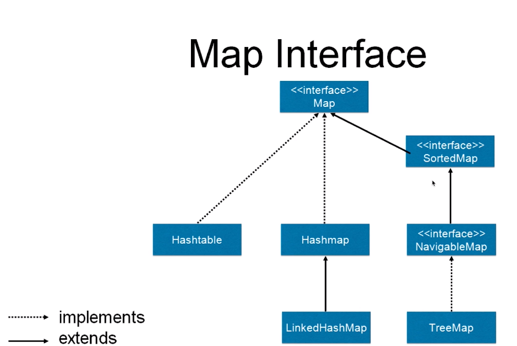
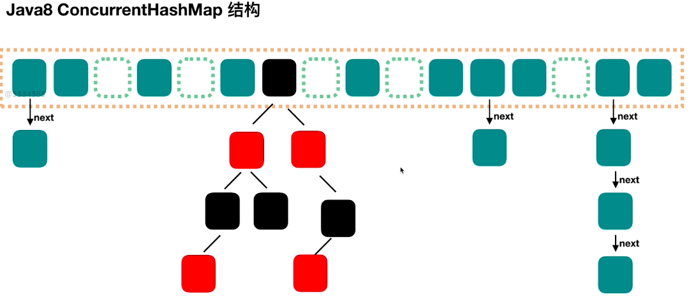
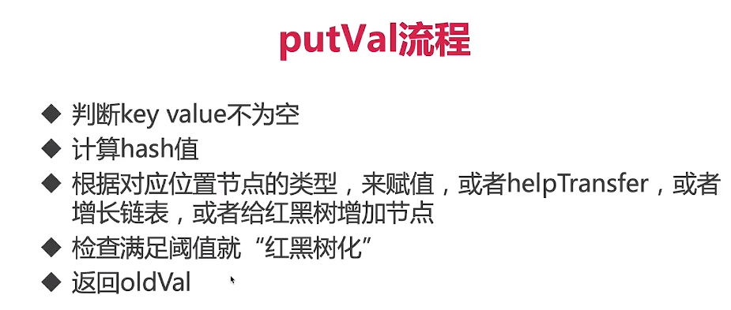

7、并发容器精讲————面试杀手锏
7.1、并发容器概览
常用的并发容器：
1)、ConcurrentHashMap：线程安全的HashMap
2)、CopyOnWriteArrayList：线程安全的List
3)、BlockingQueue：这是一个接口，表示阻塞队列，非常适合用于作为数据共享的通道；
4)、ConcurrentLinkedQueue：高效的非阻塞并发队列，使用链表实现，。可以看做一个线程安全的LinkedList；
5)、ConcurrentSkipListMap：是一个Map，使用跳表的数据结构进行快速查找；

7.2、趣说集合类的历史————古老和过时的同步容器
1)、Vector和HashTable——JDK早期的，目标是提供线程安全的集合类，随着JDK的发展，已经不能满足当今的需求了；
比如说性能不够好、对复合操作支持的不够好、有其他线程并发修改容器里面的内容时，可能会抛出异常；

2)、HashMap和ArrayList——线程不安全
虽然这两个类是线程不安全的，但是可以用Collections.synchronizedList(new ArrayList<E>())和
Collections.synchronizedMap(new HashMap<K,V>())使之变成线程安全的；
————虽然可以保证线程安全但是性能并未提高

比较不错的实现————ConcurrentHashMap和CopyOnWriteArrayList，取代同步的HashMap和同步的ArrayList(时代巨轮滚滚向前);
在绝大多数并发情况下，ConcurrentHashMap和CopyOnWriteArrayList的性能都更好；

7.3、ConcurrentHashMap(*)
7.3.1、磨刀不误砍柴工：Map简介
1)、HashMap——可以满足大多数的使用场景，所以它的使用频率是最高的

HashMap会根据键的hashcode存储，由于可以直接计算出hashcode的值，所以可以直接定位到这个键所在的位置；
所以它的访问速度是非常快的；HashMap允许键(key)为null去写入的，但是对于值是null，这个是不做限制的，
我们可以设置很多key不为null的数据并且设置它们的值为null；并且它是一个线程非安全的实现，所以如果有多个线程同时对它操作，
可能会导致数据不一致；

2)、Hashtable
历史遗留类，很多功能和HashMap是一致的，但是它是线程安全的；任何一个时刻只能有一个线程对它进行操作；
所以它的并发性远不如ConcurrentHashMap，所以不建议使用Hashtable；

3)、LinkedHashMap
HashMap的子类，保存了记录的插入顺序，并且在遍历的时候就有用了；

4)、TreeMap
由于实现了SortedMap接口，所以可以根据键去排序，默认是升序，也可以定义排序的具体实现；

MapDemo.java

总结：以上的四种实现都要求key是不可变对象，不可变对象指的是对象在创建后它的hash值不会改变；

7.3.2、为什么需要ConcurrentHashMap？
1)、为什么不用Collections.synchronizedMap()?
它是通过一个锁来保证不同线程之间的并发访问，但是由于synchronized对于并发量高的时候，它的性能并不理想；
所以不采用这种方法。
2)、为什么HashMap是线程不安全的？
 a)、同时put碰撞导致数据丢失
  多个线程同时put，计算出来的hash值有可能是一样的，这两个key会放到同一个位置；但是两个线程都放到同一个位置，
  那就会有一个人最终是丢失的；
 b)、同时put扩容导致数据丢失
  多个线程同时put，并且同时发现需要扩容，那么扩容之后的数组也只有一个会被保留下来，所以也会造成某些数据的丢失；
 c)、死循环造成的CPU 100% (*)——JDK1.7中
 java.lang.OutOfMemoryError: Java heap space
 HashMapEndlessLoop.java
 原因：多个线程，在同时扩容的时候，会造成链表的死循环(你指向我，我指向你)，这样一来就没有尽头了
  
7.3.3、九层之台，起于累土，罗马不是一天建成的：HashMap的分析
HashMap关于并发的特点
1)、非线程安全
2)、迭代是不允许修改内容
3)、只读的并发是安全的
4)、如果一定要把HashMap用在并发环境，用Collections.synchronizedMap(new HashMap())

7.3.4、JDK1.7的ConcurrentHashMap实现和分析

1)、Java7中的ConcurrentHashMap最外层是多个segment，每个segment的底层数据结构与HashMap类似，仍然是数组和链表组成的拉链法；
2)、每个segment设置了独立的ReentrantLock锁，每个segment之间互不影响，提高了并发效率；
3)、ConcurrentHashMap默认有16个Segments，所以最多可以同时支持16个线程并发写(操作分别分布在不同的Segment上)。
这个默认值可以在初始化的时候设置为其他值，但是一旦初始化以后，是不可以扩容的。

7.3.5、JDK1.8的ConcurrentHashMap实现和分析

简介：和HashMap的结构非常相似，采用的是一个个的Node(节点),当链表值大于某个阈值的时候(8)，并且总容量大于某个阈值是时；
它会把链表转为红黑树，避免的一个个的找把复杂度从O(n)降到了O(logn);

7.3.6、对比JDK1.7和1.8的优缺点，为什么要把1.7的结构改成1.8的结构
1)、数据结构上1.8提高了并发度
2)、Hash碰撞：1.7使用拉链法，1.8会先使用拉链法如果达到它的条件就转为红黑树以便做进一步的平衡提高效率；
3)、保证并发安全：1.7使用分段锁，采用segment保证并发安全，而segment继承自ReentrantLock；1.8是通过CAS+synchronized，
所以在这一点有很大不同；
4)、查询复杂度：1.7遍历链表复杂度O(n);1.8遍历红黑树复杂度就是O(logn)，所以也提高了查询效率；

为什么在超过8的时候转为红黑树？、
首先在数据量并不多的时候，即便用链表也无所谓；
红黑树的节点所占用的空间是链表的两倍，在空间上的损耗比链表要大，所以在开始默认用链表的形式；
正常情况下链表不会转为红黑树，在8的时候有千万分之一的概率会转为；那如果真的发生这种情况，我们转为红黑树，可以确保在这种极端情况下，
我们的查询依然能够保证一定的效率。

7.3.7、组合操作：ConcurrentHashMap也不是线程安全的
OptionsNotSafe.java

1)、replace用法
2)、putIfAbsent

7.3.8、实际生产案例分享
多线程务必使用ConcurrentHashMap。

7.4、CopyOnWriteArrayList
7.5、并发队列Queue(阻塞队列、非阻塞队列)
7.6、各并发容器总结