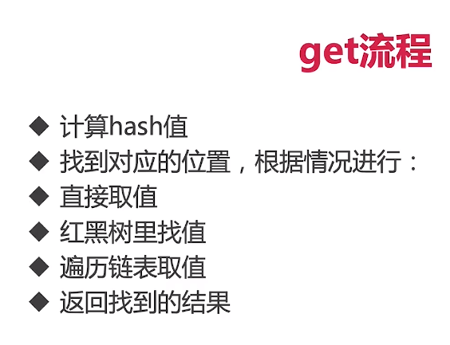
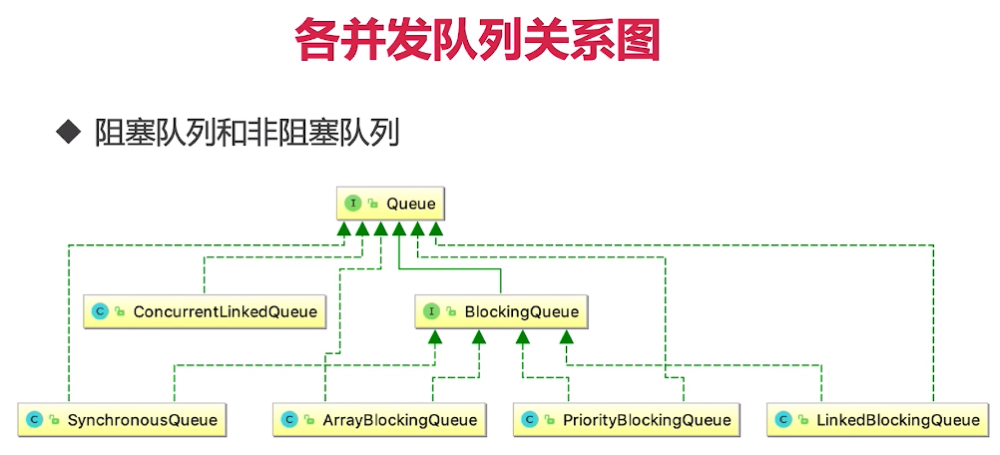
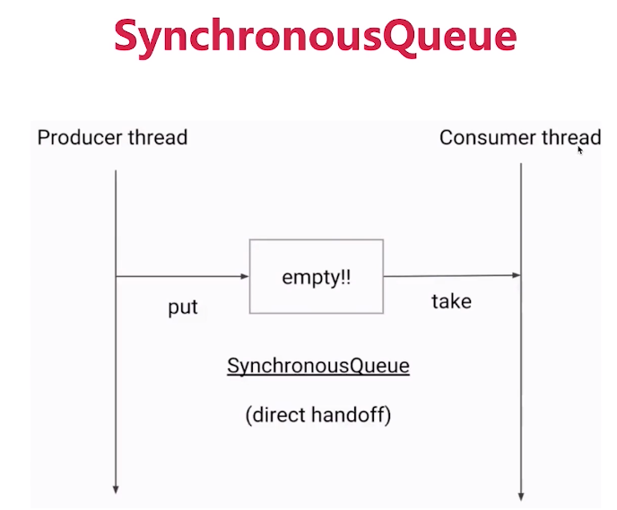

7、并发容器精讲————面试杀手锏
7.1、并发容器概览
常用的并发容器：
1)、ConcurrentHashMap：线程安全的HashMap
2)、CopyOnWriteArrayList：线程安全的List
3)、BlockingQueue：这是一个接口，表示阻塞队列，非常适合用于作为数据共享的通道；
4)、ConcurrentLinkedQueue：高效的非阻塞并发队列，使用链表实现，。可以看做一个线程安全的LinkedList；
5)、ConcurrentSkipListMap：是一个Map，使用跳表的数据结构进行快速查找；

7.2、趣说集合类的历史————古老和过时的同步容器
1)、Vector和HashTable——JDK早期的，目标是提供线程安全的集合类，随着JDK的发展，已经不能满足当今的需求了；
比如说性能不够好、对复合操作支持的不够好、有其他线程并发修改容器里面的内容时，可能会抛出异常；

2)、HashMap和ArrayList——线程不安全
虽然这两个类是线程不安全的，但是可以用Collections.synchronizedList(new ArrayList<E>())和
Collections.synchronizedMap(new HashMap<K,V>())使之变成线程安全的；
————虽然可以保证线程安全但是性能并未提高

比较不错的实现————ConcurrentHashMap和CopyOnWriteArrayList，取代同步的HashMap和同步的ArrayList(时代巨轮滚滚向前);
在绝大多数并发情况下，ConcurrentHashMap和CopyOnWriteArrayList的性能都更好；

7.3、ConcurrentHashMap(*)
7.3.1、磨刀不误砍柴工：Map简介
1)、HashMap——可以满足大多数的使用场景，所以它的使用频率是最高的

HashMap会根据键的hashcode存储，由于可以直接计算出hashcode的值，所以可以直接定位到这个键所在的位置；
所以它的访问速度是非常快的；HashMap允许键(key)为null去写入的，但是对于值是null，这个是不做限制的，
我们可以设置很多key不为null的数据并且设置它们的值为null；并且它是一个线程非安全的实现，所以如果有多个线程同时对它操作，
可能会导致数据不一致；

2)、Hashtable
历史遗留类，很多功能和HashMap是一致的，但是它是线程安全的；任何一个时刻只能有一个线程对它进行操作；
所以它的并发性远不如ConcurrentHashMap，所以不建议使用Hashtable；

3)、LinkedHashMap
HashMap的子类，保存了记录的插入顺序，并且在遍历的时候就有用了；

4)、TreeMap
由于实现了SortedMap接口，所以可以根据键去排序，默认是升序，也可以定义排序的具体实现；

MapDemo.java

总结：以上的四种实现都要求key是不可变对象，不可变对象指的是对象在创建后它的hash值不会改变；

7.3.2、为什么需要ConcurrentHashMap？
1)、为什么不用Collections.synchronizedMap()?
它是通过一个锁来保证不同线程之间的并发访问，但是由于synchronized对于并发量高的时候，它的性能并不理想；
所以不采用这种方法。
2)、为什么HashMap是线程不安全的？
 a)、同时put碰撞导致数据丢失
  多个线程同时put，计算出来的hash值有可能是一样的，这两个key会放到同一个位置；但是两个线程都放到同一个位置，
  那就会有一个人最终是丢失的；
 b)、同时put扩容导致数据丢失
  多个线程同时put，并且同时发现需要扩容，那么扩容之后的数组也只有一个会被保留下来，所以也会造成某些数据的丢失；
 c)、死循环造成的CPU 100% (*)——JDK1.7中
 java.lang.OutOfMemoryError: Java heap space
 HashMapEndlessLoop.java
 原因：多个线程，在同时扩容的时候，会造成链表的死循环(你指向我，我指向你)，这样一来就没有尽头了
  
7.3.3、九层之台，起于累土，罗马不是一天建成的：HashMap的分析
HashMap关于并发的特点
1)、非线程安全
2)、迭代时不允许修改内容
3)、只读的并发是安全的
4)、如果一定要把HashMap用在并发环境，用Collections.synchronizedMap(new HashMap())

7.3.4、JDK1.7的ConcurrentHashMap实现和分析

1)、Java7中的ConcurrentHashMap最外层是多个segment，每个segment的底层数据结构与HashMap类似，仍然是数组和链表组成的拉链法；
2)、每个segment设置了独立的ReentrantLock锁，每个segment之间互不影响，提高了并发效率；
3)、ConcurrentHashMap默认有16个Segments，所以最多可以同时支持16个线程并发写(操作分别分布在不同的Segment上)。
这个默认值可以在初始化的时候设置为其他值，但是一旦初始化以后，是不可以扩容的。

7.3.5、JDK1.8的ConcurrentHashMap实现和分析

简介：和HashMap的结构非常相似，采用的是一个个的Node(节点),当链表值大于某个阈值的时候(8)，并且总容量大于某个阈值是时；
它会把链表转为红黑树，避免的一个个的找，把复杂度从O(n)降到了O(logn);

7.3.6、对比JDK1.7和1.8的优缺点，为什么要把1.7的结构改成1.8的结构
1)、数据结构上1.8提高了并发度
2)、Hash碰撞：1.7使用拉链法，1.8会先使用拉链法如果达到它的条件就转为红黑树以便做进一步的平衡提高效率；
3)、保证并发安全：1.7使用分段锁，采用segment保证并发安全，而segment继承自ReentrantLock；1.8是通过CAS+synchronized，
所以在这一点有很大不同；
4)、查询复杂度：1.7遍历链表复杂度O(n);1.8遍历红黑树复杂度就是O(logn)，所以也提高了查询效率；

为什么在超过8的时候转为红黑树？、
首先在数据量并不多的时候，即便用链表也无所谓；
红黑树的节点所占用的空间是链表的两倍，在空间上的损耗比链表要大，所以在开始默认用链表的形式；
正常情况下链表不会转为红黑树，在8的时候有千万分之一的概率会转为；那如果真的发生这种情况，我们转为红黑树，可以确保在这种极端情况下，
我们的查询依然能够保证一定的效率。

7.3.7、组合操作：ConcurrentHashMap也不是线程安全的
OptionsNotSafe.java

1)、replace用法
2)、putIfAbsent

7.3.8、实际生产案例分享
多线程务必使用ConcurrentHashMap。

7.4、CopyOnWriteArrayList
7.4.1、诞生的历史和原因
——Java5
代替Vector和SynchronizedList，就和ConcurrentHashMap代替SynchronizedMap的原因一样；
原因：Vector和SynchronizedList的锁的粒度太大，并发效率相对比较低，并且迭代时无法编辑。

7.4.2、适用场景
1)、读操作尽可能的快，而写即使慢一些也没有太大关系;
2)、读多写少：黑名单，每日更新；监听器：迭代操作远多于修改操作；

7.4.3、读写规则
读取是完全不用加锁的，并且更厉害的是写入也不会阻塞读取操作。只有写入和写入之间需要进行同步等待。

支持并发读，只有写与写互斥；写和读、读和写是不互斥的；
CopyOnWriteArrayListDemo1.java

7.4.4、实现原理
1)、CopyOnWrite的含义
在计算机中，如果你要对一个内存进行修改的话有一种策略就是说我不对内存直接进行修改；
因为那样很危险，我会把这块内存给拷贝一份，把拷贝的东西放到新的一块内存中去修改掉，这就很安全了；
写完之后，我把原来指向原来内存的指针 指向新的内存这样一来原来的内存没有指针指向了，就可以被回收了。

2)、创建新副本，读写分离
我们这边所有的修改操作，比如add、set都是通过底层新建一个新的数组来完成；在它被修改的时候我们对整个原有数据进行一次复制，
把修改的内容写入新的副本中，最后在替换回去——这是一种读写分离的思想。
读和写使用完全不同的容器。

3)、"不可变"原理
CopyOnWriteArrayList在每一次修改过程中都是新建一个完全新的容器，所以对于旧的容器来说就不可变了；
所以旧的容器没有人操作它，它是不会变的，既然不会变那完全就是线程安全的，完全可以并发读；

4)、迭代的时候
在迭代的时候如果数组原内容已经被修改过了，但是迭代器是不知道的，迭代器使用的是旧数组而且也不会报错；

迭代时候的数据过期问题
CopyOnWriteArrayListDemo2.java

7.4.5、缺点
1)、数据一致性问题：CopyOnWrite容器只能保证数据的最终一致性，不能保证数据的实时一致性。
所以如果你希望写入的数据，马上能读到，请不要使用CopyOnWrite容器；
2)、内存占用问题：因为CopyOnWrite写的是复制机制，所以在进行写操作的时候，内存里会同时驻扎两个对象的内存。
如果内存占用特别大，就会带来一定的开销。

7.4.6、源码分析
数据结构

7.5、并发队列Queue(阻塞队列、非阻塞队列)
7.5.1、为什么要用队列
1)、用队列可以在线程间传递数据：生产者消费者模式、银行转账
2)、考虑锁等线程安全问题的重任从"你" 转移到了"队列"上

7.5.2、并发队列简介
1)、Queue：Java5，用来保存一组等待处理的数据，有很多的实现
2)、BlockingQueue：增加了可阻塞的插入和获取操作，如果队列为空，取得这个操作就会一直阻塞；
如果队列满了，插入就插不进去，也会一直阻塞；直到队列有一个被拿走，有个空间空出来——生产者消费者模式；

7.5.3、各并发队列关系图

7.5.4、阻塞队列(BlockingQueue)(*)
1)、什么是阻塞队列

 a)、简介、地位
   (1)、阻塞队列是具有阻塞功能的队列，所以它首先是一个队列，其次是具有阻塞功能；
   (2)、通常，阻塞队列的一端是给生产者放数据用，另一端给消费者拿数据用。阻塞队列是线程安全的，
   所以生产者和消费者都可以是多线程的。
 阻塞功能：最有特色的两个带有阻塞功能的方法是
 b)、take()方法：获取并移除队列的头结点，一旦执行take的时候，队列里无数据，则阻塞，直到队列里有数据；
 c)、put()方法：插入元素。但是如果队列已满，那么就无法继续插入，则阻塞，直到队列里有了空闲空间；
 d)、是否有界(容量有多大)：这是一个非常重要的属性，无界队列意味着里面可以容纳非常多(Integer.MAX_VALUE,约为2的31次，是非常大的一个数，
 可以近似认为是无限容量)
 e)、阻塞队列和线程池的关系：阻塞队列是线程池的重要组成部分；

2)、主要方法介绍
a)、put、take(*)
特点会阻塞住；

b)、add、remove、element
add：添加，和put很像，但是区别就在于，如果满了放不进去，add会抛出异常；
remove：发现队列空了，还想删除也会抛出异常；
element：返回队列头元素，如果是空也会抛出异常；

c)、offer、poll、peek
offer：添加一个元素，如果满了会返回一个boolean值——false;
poll：试图取一个元素，如果为空则会返回一个null
peek：poll在取元素的同时会删除，peek不删除只取出，共同点就是如果为空则会返回一个null；

3)、ArrayBlockingQueue
 a、有界
 b、指定容量
 c、公平：还可以指定是否需要保证公平，如果想保证公平的话，那么等待了最长时间的线程会被优先处理，
不过这会同时带来一定的性能损耗

ArrayBlockingQueueDemo.java

4)、LinkedBlockingQueue
 a、无界
 b、容量Integer.MAX_VALUE
 c、内部结构：Node、两把锁。分析put方法
5)、PriorityBlockingQueue
 a、支持优先级
 b、自然顺序(不是先进先出)
 c、无界队列：容量不够可以扩容
 d、PriorityQueue的线程安全版本
 
6)、SynchronousBlockingQueue
 a、容量为0
 b、需要注意的是，SynchronousQueue的容量不是1而是0，因为SynchronousQueue不需要去持有元素，它所做的就是直接传递(direct handoff)
 c、效率很高

 e、注意点：
  (1) SynchronousQueue没有peek等函数，因为peek的含义是取出头结点，但是SynchronousQueue的容量是0，所以连头结点都没有，
  也就没有peek方法。同理，没有iterate相关方法。
  (2) 是一个极好的用来直接传递的并发数据结构
  (3) SynchronousQueue是线程池Executors.newCachedThreadPool()使用的阻塞队列

7)、DelayQueue
 a、延迟队列，根据延迟时间排序
 b、元素需要实现Delayed接口，规定排序规则

7.5.5、非阻塞队列
并发包中的非阻塞队列只有ConcurrentLinkedQueue这一种，顾名思义ConcurrentLinkedQueue是使用链表作为其数据结构的，
使用CAS非阻塞算法来实现线程安全(不具备阻塞功能)，适合用在对性能要求较高的并发场景。用的相对比较少一些。

7.5.6、如何选择适合自己的队列(*)
1)、边界
2)、空间
3)、吞吐量

7.6、各并发容器总结
1)、java.util.concurrent包提供的容器分为3类：Concurrent*、CopyOnWrite*、Blocking*;
2)、Concurrent*的特点是大部分通过CAS实现并发，而CopyOnWrite*则是通过复制一份原数据来实现的，
Blocking通过AQS实现的；
