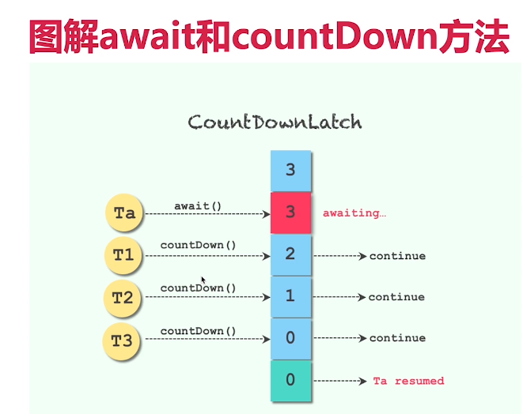

8、控制并发流程
8.1、什么是控制并发流程
在我们不控制的情况下，并发的时候多个线程是尽可能的跑，并且受线程调度器控制，这个时候实际上是不受程序员控制的；
那有的时候要求某一些任务先执行，要求一些任务等某些任务执行完毕在执行的话，这个时候就必须去控制它，依照线程调度器
肯定是不靠谱的。
所以控制并发流程的工具类，作用就是帮助我们程序员更容易得让线程之间合作。
让线程之间相互配合，来满足业务逻辑。
比如让线程A等待线程B执行完毕之后，在执行等合作策略。

8.2、CountDownLatch到计时门闩
8.2.1 CountDownLatch类的作用
并发流程控制的工具
1)、倒数门闩
2)、例子：购物拼团；大巴，人满发车；
3)、流程：倒数结束之前，一直处于等待状态，直到倒计时结束了，此线程才继续工作；

8.2.2 类的主要方法介绍
1)、CountDownLatch(int count)：仅有一个构造函数，参数count为需要倒数的数值。
2)、await()：调用await()方法的线程会被挂起，它会等待直到count值为0才继续执行。
3)、countDown()：将count值减1，直到为0时，等待的线程会被换起。

8.2.3 两个典型用法
CountDownLatchDemo1.java
1)、用法一：一个线程等待多个线程都执行完毕，再继续自己的工作。

CountDownLatchDemo2.java
2)、用法二：多个线程等待某一个线程的信号，同时开始执行。

二者结合：CountDownLatchDemo1And2.java

3)、注意点：
a、拓展用法：多个线程等多个线程完成执行后，再同时执行。
b、CountDownLatch是不能够重用的，如果需要重新计数，可以考虑使用CyclicBarrier
或者创建新的CountDownLatch实例。

4)、总结
a、两个典型用法：一等多和多等一
CountDownLatch类在创建实例的时候，需要传递倒数次数。倒数到0的时候，之前等待的线程会继续运行；
b、CountDownLatch不能回滚重置；

8.3、Semaphore信号量
8.4、Condition接口(又称条件对象)
8.5、CyclicBarrier循环栅栏