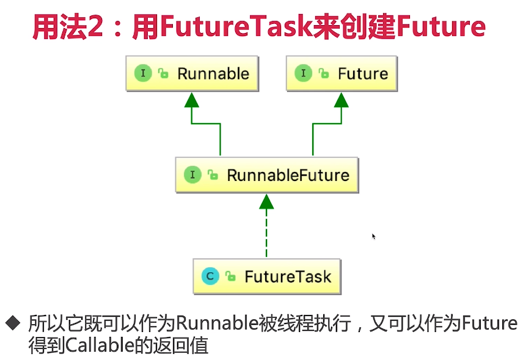

10、 获取子线程的执行结果【来而不往非礼也】Future和Callable——治理线程的第二大法宝(*)
10.1、Runnable的缺陷
10.1.1 缺陷
1)、不能返回一个返回值
2)、也不能抛出checked Exception
RunnableCantThrowsException.java

10.1.2 为什么会有这样的缺陷？
因为run方法在定义的时候有两点：第一点返回的是void；第二点没有声明异常；这两点在我们实现的时候是没有办法改变的。

10.1.3 Runnable为什么设计成这样？
如果说run可以抛出异常，那么最终是Thread类接收；但是最终处理异常 我们也处理不了，
所以不如在run方法中 try catch起来，然后做一些处理措施。

10.1.4 针对于无法抛出检查后异常这个缺陷的补救措施
引出Callable接口。

10.2、Callable接口
1)、类似于Runnable，被其他线程执行的任务
2)、实现call方法
3)、有返回值

10.3、Future类
10.3.1 作用：
一个方法的计算可能会很耗时，但是在计算的过程中我没有必要在原地等你返回，我可以用子线程去执行，等到计算出结果之后我在用Future直接获取过来；

10.3.2 Callable和Future的关系
1)、我们可以用Future.get来获取Callable接口返回的执行结果；
还可以通过Future.isDone()来判断任务是否已经执行完了，以及取消这个任务，限时获取任务的结果等。
2)、在call()未执行完毕之前，调用get()的线程(假定此时是主线程)会被阻塞，
直到call()方法返回了结果后，此时future.get()才会得到该结果，然后主线程才会切换到runnable状态；

总结：Future是一个存储器，它存储了call()这个任务的结果，而这个任务的执行时间是无法提前确定的，因为这完全取决于call()方法执行的情况。
Callable和Future是一个相互配合的关系，最终通过Future拿到call方法执行的结果。

10.3.1 Future的主要方法：一共5个
1)、get()方法：获取结果
get方法的行为取决于Callable任务的状态，只有以下这5种情况：
a、任务正常完成：get方法会立刻返回结果
b、任务尚未完成(任务还没开始或进行中)：get将阻塞并直到任务完成
c、任务执行过程中抛出Exception：get方法会抛出ExecutionException：这里的抛出异常，是call()执行时产生的那个异常，
看到这个异常类型是java.util.concurrent.ExecutionException。不论call()执行时抛出的异常类型是什么，最后get()方法抛出的异常类型都是ExecutionException。
d、任务被取消：get方法会抛出CancellationException
e、任务超时：get方法有一个重载方法，是传入一个延迟时间的，如果时间到了还没有获得结果，get方法就会抛出TimeoutException。

2)、get(long timeout, TimeUnit unit)：有超时的获取
a、超时的需求很常见
b、用get(long timeout, TimeUnit unit)方法是，如果call()在规定时间内完成了任务，那么就会正常获取到返回值；
而如果在指定时间内没有计算出结果，那么就会抛出TimeoutException。
c、超时不获取，任务需取消

3)、cancel方法：取消任务的执行
 a、如果这个任务还没有开始执行，那么这种情况最简单，任务会被正常的取消，未来也不会被执行，方法返回true。
 b、如果任务已完成，或者已取消：那么cancel()方法会执行失败，方法返回false；
 c、如果这个任务已经开始执行了，那么这个取消方法将不会直接取消该任务，而是会根据我们填的参数mayInterruptIfRunning做判断：
  true——发送中断信号;false——不发送，程序继续执行。
  
 Future.cancel(true)适用于：我们知道中断的任务有能力正确处理中断的时候；
 Future.cancel(false)仅用于避免启动尚未启动的任务，适用于：
  (1) 未能处理interrupt的任务
  (2) 不清楚任务是否支持取消
  (3) 需要等待已经开始的任务执行完成
4)、isDone()方法：判断线程是否执行完毕
5)、isCancelled()方法：判断是否被取消

10.4、用法1：线程池的submit方法返回Future对象，6个代码演示
1)、首先，我们要给线程池提交我们的任务，提交时线程池会立刻返回给我们一个空的Future容器。当线程的任务一旦执行完毕，也就是当我们可以获取结果的时候，
线程池便会把该结果填入到之前给我们的那个Future中去(而不是创建一个新的Future)，
我们此时便可以从该Future中获取任务执行的结果。
a、get的基本用法——OneFuture.java
b、Callable的Lambda表达式形式——OneFutureLambda.java
c、多个任务，用Future数组来获取结果
d、任务执行过程中抛出Exception和isDone展示：GetException.java
e、获取任务超时：Timeout.java

10.5、用法2：用FutureTask来创建Future
1)、用FutureTask来获取Future和任务的结果
2)、FutureTask是一种包装器，可以把Callable转化成Future和Runnable，它同时实现二者的接口；

3)、把Callable实例作为参数，生成FutureTask的对象，然后把这个对象当做一个Runnable对象，用线程池或另起线程去执行这个Runnable对象，
最后通过FutureTask获取刚才执行的结果；
FutureTaskDemo.java

10.6、Future的注意点
1)、当for循环批量获取future的结果时，容易发生一部分线程很慢的情况，get方法调用时应使用timeout限制。
2)、Future的生命周期不能后退
 生命周期只能前进，不能后退。就和线程池的生命周期一样，一旦完全完成了任务，它就永久停在了"已完成"的状态，不能重头再来。
 