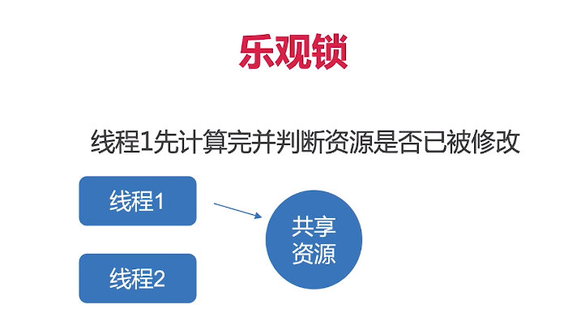

3、不可不说的“锁”事【种类繁多，如何一一突破？】
3.1、Lock接口
3.1.1 简介、地位、作用
1)、锁是一种工具，用于控制对共享资源的访问。
2)、Lock和synchronized，这两个是最常见的锁，它们都可以达到线程安全的目的，但是在使用上和功能上又有较大的不同。
3)、Lock并不是用来代替synchronized的，而是当使用synchronized不合适或不足以满足要求的时候，来提供高级功能的。
4)、Lock接口最常见的实现类是ReentrantLock
5)、通常情况下，Lock只允许一个线程来访问这个共享资源。不过有的时候，一些特殊的实现也可允许并发访问，比如ReadWriteLock里面的ReadLock。

3.1.2 为什么synchronized不够用？为什么需要Lock？
1)、效率低：锁的释放情况少（两种方式）、试图获得锁时不能设定超时、不能中断一个正在试图获得锁的线程；
2)、不够灵活(读写锁更灵活)：加锁和释放的实际单一，每个锁仅有单一的条件（某个对象），可能是不够的
3)、无法知道是否成功获取到锁

3.1.3 方法介绍
在Lock中声明了四个方法来获取锁：
lock()、tryLock()、tryLock(long time, TimeUnit unit)和lockInterruptibly()
3.1.4、四个方法的区别
1)、lock MustUnlock.java
a、lock()就是最普通的获取锁。如果锁已被其他线程获取，则进行等待；
b、Lock不会像synchronized一样在异常时自动释放锁；
c、因此最佳实践是，在finally中释放锁，以保证发生异常时锁一定被释放；
d、lock()方法不能被中断，这会带来很大的隐患：一旦陷入死锁，lock()就会陷入永久等待
2)、tryLock
a、tryLock()用来尝试获取锁，如果当前锁没有被其他线程占用，则获取成功，并且返回true，否则返回false，代表获取锁失败；
b、相比于lock，这样恶毒方法显然功能更强大了，我们可以根据是否能获取到锁来决定后续程序的行为；
c、该方法会立即返回，即便在拿不到锁时不会一直在那等；

3)、tryLock(long time, TimeUnit unit)：超时就放弃
TryLockDeadlock.java

4)、lockInterruptibly：try(long time, TimeUnit unit)把超时时间设置为无限。在等待锁的过程中，线程可以被中断；
5)、unlock()：解锁
注意，要写在finally里面，获取锁之后的第一件事就是把unlock放到finally里面，在写业务代码。

3.1.4 可见性保证
指的是线程与线程之间并不是随时能看到对方最新的动态的；
happens-before原则：我们这件事发生了，如果其他线程一定能看到我们做的其他修改的话，就代表拥有happens-before；

Lock的加解锁和synchronized有同样的内存语义，也就是说，下一个线程加锁后可以看到所有前一个线程解锁前发生恶毒所有操作；

3.2、锁的分类

这些分类是从各种不同角度出发去看的；
这些分类并不是互斥的，也就是多个类型可以并存：有可能一个锁，同时属于两种类型；
比如：ReentrantLock既是互斥锁，又是可重入锁，说明了这个锁又多个属性。
3.2.1 乐观锁和悲观锁
1)、为什么会诞生非互斥同步锁(乐观锁)————互斥同步锁(悲观锁)的劣势
因为互斥同步锁存在一定的劣势：
————互斥同步锁的劣势
a)、阻塞和唤醒带来的性能劣势：悲观锁锁住之后就是独占的，其他线程如果还想获得相同的资源，就必须等待，带来的最大问题就是性能问题；
乐观锁最主要解决的就是性能问题，乐观锁不需要把线程挂起；
b)、悲观锁可能陷入永久阻塞：如果持有锁恶毒线程被永久阻塞，比如遇到了无限循环、死锁等活跃性问题，那么等待该线程释放锁的那几个悲催恶毒线程，将永远也得不到执行；
c)、优先级反转：如果被阻塞的线程优先级比较高，而持有锁的线程优先级比较低，这就会导致优先级反转；

2)、什么是乐观锁和悲观锁
从人的性格分析：
乐观锁：遇到什么事情都很开心，认为事情总是不大会失败的，出错是小概率；所以先肆无忌惮的做一些事情，如果说真的遇到问题，有则改之无则加勉；
悲观锁：总是担惊受怕，认为出错是一种常态，无论事无巨细，都考虑的面面俱到，滴水不漏，保证万无一失。

从是否锁住资源的角度分析：
悲观锁：如果我不锁住这个资源，别人就会来争抢，就会造成数据结果错误，所以每次悲观锁为了确保结果恶毒正确性，会在每次获取并修改数据时，把数据锁住，
让别人无法访问改数据，这样就可以确保数据内容万无一失；在Java最典型的悲观锁实现就是synchronized和Lock相关类；
具体流程：一个线程获取到锁，另一个必须等待，直到该线程释放才可以获取；
乐观锁：
a、认为自己在处理操作的时候不会有其他线程来干扰，所以并不会锁住被操作对象；
b、在更新的时候，去对比在我修改的期间，数据有没有被其他人改变过：如果没有被改变，就说明真的是只有我自己在操作，那我就正常去修改数据；
c、如果数据和我一开始拿到的不一样了，说明其他人在这段时间内改过数据，那我就不能继续刚才的更新数据过程了，我会选择放弃、报错、重试等策略；
d、乐观锁的实现一般都是利用CAS算法来实现的；
CAS的核心思想就是我可以在一个原子操作内，把你这个数据对比并且交换；那么在此期间是不会有人能打断我的。

乐观锁操作：

3)、典型例子：PessimismOptimismLock.java
悲观锁：synchronized和lock接口
乐观锁的典型例子就是原子类、并发容器等；

Git：Git就是乐观锁的典型例子，当我们往远端仓库push的时候，git会检查远端仓库的版本
是不是领先于我们现在的版本，如果远程仓库的版本号和本地不一样，就表示有其他人修改了远端代码了，
我们这次提交就失败，如果远端和本地版本号一致，我们就可以顺利提交版本到远端仓库。

数据库：
a)、select for update就是悲观锁
b)、用version控制数据库就是乐观锁

4)、开销对比
悲观锁的原始开销要高于乐观锁，但是特点是一劳永逸，临界区持锁时间就算越来越差，也不会对互斥锁的开销造成影响；
相反，虽然乐观锁一开始的开销比悲观锁小，但是如果自旋时间很长或者不停重试，那么消耗的资源也会越来越多。

5)、两种锁各自的使用场景
悲观锁：适合并发写入多的情况，适用于临界区持锁时间比较长的情况，悲观锁可以避免大量的无用自旋等消耗，典型情况：
 a)、临界区有IO操作
 b)、临界区代码比较复杂或者循环量大
 c)、临界区竞争非常激烈
乐观锁：适合并发写入少，大部分是读取的场景，不加锁的能让读取性能大幅提高。

3.2.2、可重入锁和非可重入锁，以ReentrantLock为例(*)
可重入锁使用案例：
普通用法1：预定电影院座位 CinemaBookSeat.java
普通用法2：打印字符串 
3.5、公平锁和非公平锁
3.6、共享锁和排它锁：以ReentrantReadWriteLock读写锁为例(*)
3.7、自旋锁和阻塞锁
3.8、可中断锁：顾名思义就是可以响应中断的锁
3.9、锁优化