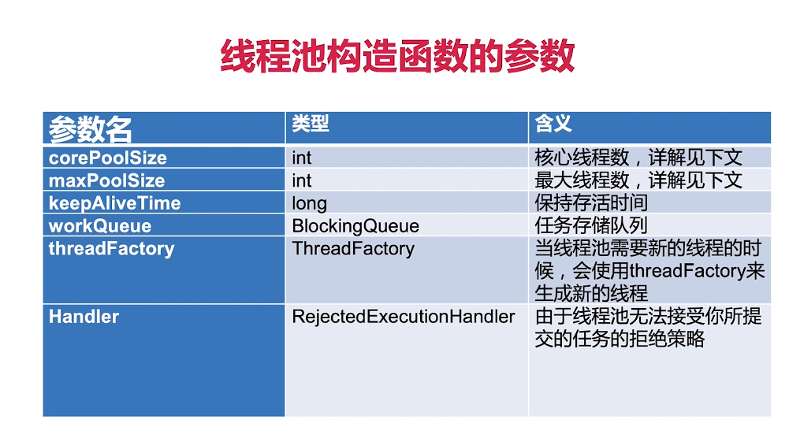
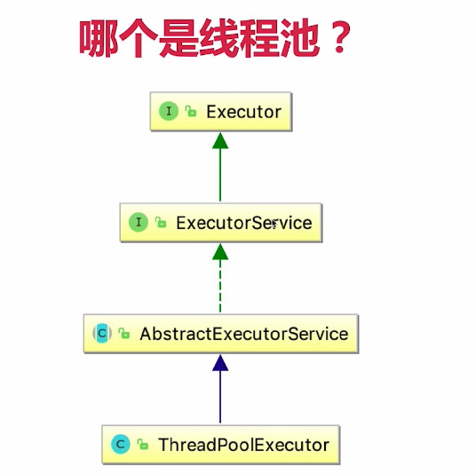

玩转Java并发工具，精通JUC，成为并发多面手
Java并发成神之路——JUC全方位详解：
https://naotu.baidu.com/file/89fb28b05e3395800f9dc2d332d2b198?token=9b45e08e55281667

1、线程池————治理线程的最大法宝
1.1 线程池的自我介绍
1.1.1 线程池的重要性
1.1.2 什么是"池"？
软件中的"池"，可以理解为计划经济；我们的系统资源是有限的，比方说我们只有10个线程，我们就创造10个线程的线程池；
但是我们的任务可能非常多，比方说1000个任务；但是资源只有这10个线程，那么就要把这1000任务放到这10个线程里面去，我慢慢去执行。
还有一个好处就是，有了这10个线程之后，就不需要在创建更多的线程了，因为创建线程也需要花费资源，这10个线程，我可以把总量控制住，
而且可以复用每一个线程。
所以总体来讲，线程池有两个好处：1、复用线程；2、可以控制资源总量。

如果不使用线程池，每一个任务都要新开一个线程处理：
1)、一个线程：EveryTaskOneThread；b、for循环创建线程：ForLoop
当任务数量上升到1000。。。
这样开销太大（尤其是内存），我们希望有固定数量的线程，来执行这1000个线程，这样就避免了反复创建并销毁线程所带来的的开销问题。

1.1.3 为什么要使用线程池？
2)、反复创建线程开销大；b、过多的线程会占用太多内存；
解决以上两个问题的思路：
a)、用少量的线程————避免内存占用过多；
b)、让这部分线程都保持工作，且可以反复执行任务————避免生命周期的损耗；

1.1.4 线程池的好处
1)、加快响应速度；
2)、可以更加合理的利用CPU和内存
3)、可以统一管理资源

1.1.5 线程池适用的场合
1)、服务器接受到大量请求时，使用线程池计数是非常合适的，它可以大大减少线程的创建和销毁次数，提高服务器的工作效率；
2)、实际上，在开发中，如果需要创建5个以上的线程，那么就可以使用线程池来管理；

1.2 创建和停止线程池
1.2.1 线程池构造函数的参数

1)、corePoolSize指的是核心线程数：线程池在完成初始化后，默认情况下，线程池中并没有任何线程，线程池会等待有任务到来时，在创建新线程去执行任务。
2)、maxPoolSize：线程池有可能会在核心线程数的基础上，增加额外一些线程，但是这些新增加的线程数有一个上限，这就是最大量maxPoolSize；
3)、keepAliveTime：如果说线程池当前的线程数多于corePoolSize，那么如果多余的线程空闲时间超过keepAliveTime，它们就会被终止————相当于回收；
默认情况下回收的是多于corePoolSize的数量会被回收，除非修改allowCoreThreadTimeOut为true，这样会把核心的数量也回收，但是通常不采用。
4)、ThreadFactory：新线程都是有ThreadFactory创建的，默认使用Executors.defaultThreadFactory()，创建出来的线程都在同一个线程组，拥有同样的NORM_PRIORITY优先级并且都不是守护线程。
如果自己指定ThreadFactory，那么就可以改变线程名，线程组，优先级，是否是守护线程等。
5)、workQueue：工作队列，有3种最常见的队列类型：
 a、直接交换——SynchronousQueue：如果说任务不会特别多，我们只是把任务通过这个队列做一下简单的中转，交给线程去处理的话，那么就可以使用这个队列，队列内部的容量是0；
 b、无界队列——LinkedBlockingQueue：不会被塞满，可以防止流量突增，但是缺点是如果处理不及时可能会造成内存浪费或者OOM异常；
 c、有界的队列：ArrayBlockingQueue：可以设置队列大小，此时线程的maxPoolSize就有意义了。

1.2.2 添加线程规则

1)、如果线程数小于corePoolSize，即使其他工作线程处于空闲状态，也会创建一个新线程来运行新任务；
2)、如果线程等于(或大于)corePoolSize但少于maximumPoolSize，则将任务放入队列；
3)、如果队列已满，并且线程数小于maxPoolSize，则创建一个新线程来运行任务；
4)、如果队列已满，并且线程数大于或等于maxPoolSize，则拒绝该任务；

举个例子：线程池：核心池大小为5，最大池大小为10.队列为100。
因为线程中的请求最多会创建5个，然后任务将被添加到队列中，直到达到100；
当队列已满时，将创建最新的线程maxPoolSize，最多到10个线程，如果再来任务，就拒绝。

总结：增减线程的特点
1)、通过设置corePooSize和maximumPoolSize相同，就可以创建固定大小的线程池；
2)、线程池希望保持较少的线程数，并且只有在负载变得很大时才增加它；
3)、通过设置maximumPoolSize为很高的值，例如Integer.MAX_VALUE，可以允许线程池容纳任意数量的并发任务；
4)、只有在队列填满时才创建多于corePoolSize的线程，所以如果你使用的是无界队列(例如LinkedBlockingQueue)，那么线程数就不会超过corePoolSize。

1.2.3 线程池应该手动创建还是自动创建？
手动创建更好，因为这样可以让我们更加明确线程池的运行规则，避免资源耗尽的风险。
1)、自动创建线程池(也就是直接调用JDK封装好的构造函数)可能带来哪些问题？
a、newFixedThreadPool：FixedThreadPoolTest.java
 由于传进去的LinkedBlockingQueue 是没有容量上限的，所以当请求数越来越多，并且无法及时处理完毕的时候，也就是请求堆积的时候，会容易造成占用大量的内存，可能会导致OOM；

b、newSingleThreadExecutor：SingleThreadExecutor.java
 可以看出，这里和刚才的NewFixedThreadPool的原理基本一样，只不过把线程池直接设置成了1，所以这也会导致同样的问题，也就是当请求堆积的时候，可能会占用大量的内存。
 
c、newCachedThreadPool：可缓存线程池 CachedThreadPool.java
 特点：无界线程池，具有自动回收多余线程的功能；默认时间是60s
 这里的弊端在于第二个参数maximumPoolSize被设置为了Integer.MAX_VALUE，这可能会创建数量非常多的线程，甚至导致OOM。

2)、正确的创建线程池的方法
根据不同的业务场景，自己设置线程池参数，比如我们的内存有多大，我们想给线程取什么名字等等。

1.2.3 线程池里的线程数量设定多少比较合适？
1)、CPU密集型(需要大量的计算，比如：加密，计算hash等)：最佳线程数为CPU核心数的1-2倍左右；
2)、耗时IO型(读写数据库、文件、网络读写等)：最佳线程数一般会大于CPU核心数很多倍，以JVM线程监控显示繁忙情况为依据，保证线程空闲可以衔接上，参考Brain Goetz推荐的计算方法：
线程数 = CPU核心数 * (1 + 平均等待时间/平均工作时间);

最最精准的是根据不同的情况去做压测，可以得出具体的数值。

1.2.4 常见线程池的特点
1)、FixedThreadPool：固定数量的线程池，设定多少就是多少，不会超出这个值；
2)、CachedThreadPool：可缓存线程池，具有自动回收多余线程的功能；
3)、ScheduledThreadPool：支持定时及周期性任务执行的线程池；
4)、SingleThreadExecutor：单线程的线程池：它只会用唯一我的工作线程来执行任务；它的原理和FixedThreadPool是一样的，但是此时的线程数量被设置为了1；

1.2.5 阻塞队列分析
1)、FixedThreadPool和SingleThreadExecutor的Queue是LinkedBlockingQueue？
由于线程数量不能再膨胀了，不得不用一个能够存储很多的队列，来帮助我们存储我们的任务；新来的任务数量我们无法估计，所以只能在自身上做文章，
那么就要把阻塞队列的容量设置成无限大。

2)、为什么CachedThreadPool使用的Queue是SynchronousQueue？
在这种线程池的情况下不需要队列去存储，任务过来了直接就交给新的线程去执行了，新的线程的数量是不受限制的，所以就不需要队列来存储任务。

3)、ScheduledThreadPool使用的是延迟队列，DelayedWorkQueue
延迟队列的能力就是可以把里面的任务根据时间先后做延迟。

4)、workStealingPool是JDK1.8加入的
a、这个线程池和之前的都有很大不同，如果一个任务可以产生子任务，那么就可以用这个场景。
比如说：二叉树的遍历、处理矩阵；可以层层拆分。
b、使用这个线程池，拥有一定的窃取能力的，每个线程之间是会合作的，刚才说的子任务会被放到每一个线程自己独有的任务队列中去，而不是公共队列。

1.2.6 停止线程池的正确方法 ShutDown.java
1)、shutdown——关闭线程池：初始化整个关闭过程，不一定马上就能关闭；会把正在执行的任务以及队列里正在等待的任务都执行完毕之后再关闭；
并且，执行了shutdown之后如果有新的任务提交的话就会拒绝，抛出拒绝的异常————RejectedExecutionException；
2)、isShutdown———返回true/false

3)、isTerminated：判断整个程序是否执行完毕；

4)、awaitTermination：等待一段时间，如果程序执行完毕就返回true，否则返回false；

5)、shutdownNow——立刻关闭：
当线程池执行shutdownNow之后：
a、正在运行的线程就会收到interrupted信号；
b、正在队列中等待的那部分任务会直接返回；

1.3 常见线程池的特点和用法

1.4 任务太多，怎么拒绝？
1.4.1 拒绝时机
1)、当Executor关闭时，提交新任务会被拒绝；
2)、以及当Executor对最大线程和工作队列容量使用有限边界并且已经饱和时；

1.4.2 4种拒绝策略
1)、AbortPolicy：抛出一个异常

2)、DiscardPolicy：丢弃策略，并且不会通知

3)、DiscardOldestPolicy：丢弃最老的

4)、CallerRunsPolicy：谁提交的任务，谁去跑

1.5 钩子方法，给线程池加点料
1.5.1 在每个任务执行前后做点事情
1)、日志、统计——PauseableThreadPool.java

1.6 实现原理，源码分析
1.6.1 线程池组成部分
1)、线程池管理器：创建线程池，停止线程池等
2)、工作线程：创建出来的线程
3)、任务队列：存放任务的队列，支持并发
4)、任务接口(Task)：一个一个的任务

1.6.2 Executor家族？
1)、线程池、ThreadPoolExecutor、ExecutorService、Executor、Executors等这个多核线程池相关的类，大家都是什么关系？

2)、哪个是线程池？

Executor：顶层接口
ExecutorService：继承了Executor的方法，又增加了新的方法；
Executors：工具类，帮助我们快速创建线程池等；
ThreadPoolExecutor：线程池，通常也可以把ExecutorService理解为线程池。

3)、线程池实现任务复用的原理：用相同的线程执行不同的任务
不需要重复的启动线程(thread.start())，只需要启动那些已有的固定数量的，后面来的任务都会在同样的线程中去循环的跑；
也就是说在线程池的线程中，这个线程不是普通的线程，这个线程的run方法会不停的检测有没有新的任务进来，如果有就会调用新的任务的run方法
把一系列的任务串联起来执行，线程池就是让我们这些固定的线程不停的从我们的队列中取出来，取出新的任务并且执行。

1.7 线程池的状态
Running：接受新任务并处理排队任务
ShutDown：不接受新任务，但处理排队任务
Stop：不接受新任务，也不处理排队任务，并中断正在进行的任务
Tidying：中文是整洁，所有任务都已终止，workerCount为0时，线程会转换到Tidying状态，并将运行terminate()钩子方法
Terminated：terminate()运行完成

1.8 使用线程池的注意点
1)、避免任务堆积————防止OOM
2)、避免线程数过度增加
3)、排查线程测漏